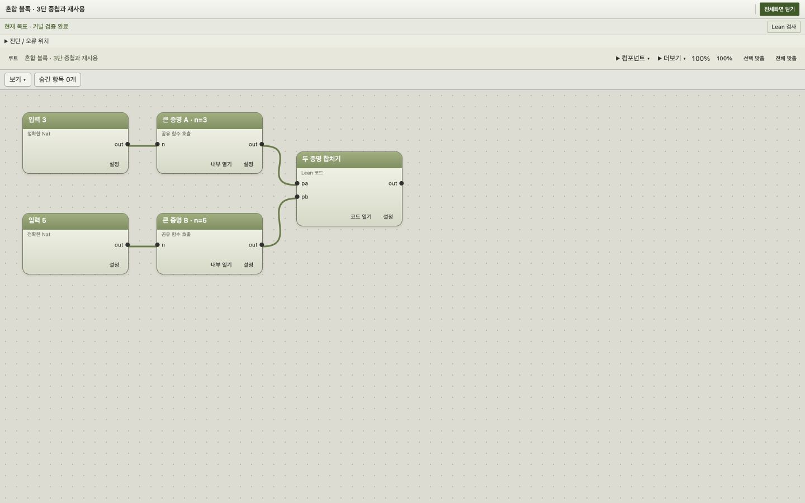

# GLEAN 블록 계층·긴 코드·Lean 가져오기 구현 결과

Copyright (c) 2026 GLEAN contributors. Released under Apache 2.0.

고정된 [계획](../2026-10-07-block-hierarchy-import/PLAN.md)의 첫 릴리스 P0-A/B/C/D + P1을 구현하고, 구현자 → 요구사항 감사자 → 설계 감사자 → 수정 → 재시험 루프를 수행했다. root는 실제 브라우저 조작과 시각적 검토를 담당했다. **첫 릴리스 32개 수락 항목 PASS, 후속 P2/P3 5개 항목 DEFERRED**다. 전체 계획의 37개를 완료했다는 뜻은 아니다.

## 사용할 수 있는 기능

- 블록 숨김, 선택만 보기, 단계별 격리/복귀, 숨긴 항목 찾기, 직접 입력·사용처 추가. 표시를 바꿔도 증명의 의미와 전체 검증 범위를 보존한다.
- 접고 펼치는 중첩 그룹과 공개 입출력이 있는 graph/code 부모. 그래프 안의 코드·그래프·코드 손자를 실제로 연결하고 Lean으로 검증할 수 있다. 공유 정의와 호출별 인자·화면 상태를 구별한다.
- 긴 Lean 본문용 편집기: 검색, 행 이동, 들여쓰기 접기, 목표 조회, 정확한 오류 위치 이동. 1 MiB급 실제 증명과 200개 공유 호출의 저장·복구·Undo·검사 취소 경로를 확인했다.
- `.lean` 즉시 파일 블록 가져오기, 원본 바이트 보관, 실제 현재 파일의 선언·타입·위치·직접 의존 분석. 1,000개 선언은 점진적으로 표시한다. 설치된 공개 선언은 별도 출처 확인 후 참조 그래프로 만들 수 있다.
- 그래프 전체화면, 유동 패널, 중첩 제목·포트·버튼 간격, 빈 공간 생성 배치, 연결 경계를 포함한 전체 맞춤. 손상된 선택 메타데이터는 원문을 보존하며 복구를 안내한다.

실행은 저장소 루트에서 `./glean/scripts/editor`, 화면은 [로컬 GLEAN](http://127.0.0.1:8765/)이다. 사용법은 [GLEAN.md](../../../GLEAN.md)에 정리했다.

## 검증 결과

최종 제품 변경 뒤 실행한 검사다. 단위/통합 검사의 성공과 실제 UI 관찰을 따로 기록했다.

| 검사 | 결과 |
| --- | --- |
| GLEAN Lake build | 종료 코드 0, 4 jobs |
| `lake env lean tests/Smoke.lean` | 종료 코드 0 |
| JavaScript 전체 | 211 PASS, 실패/건너뜀 0, 2.148초 |
| Python 전체 (`GLEAN_SOURCE_INTEGRATION=1`) | 166 tests, OK, 종료 코드 0, 126.721초 |
| `git diff --check` | 종료 코드 0 |
| 최종 브라우저 error 로그 | 0건 |

JavaScript는 PATH에 Node가 없어 최초 실행이 127로 종료됐고, 설치된 Codex 런타임의 Node 절대 경로로 재실행해 통과했다. [JavaScript 로그](final-js-tests.log), [Python 로그](final-python-tests.log).

별도 실제 증명 대조도 통과했다. 64 KiB/1 MiB 정상 본문은 엄격한 커널·목표 검사와 공리 없음이 확인됐고, 잘못된 마지막 단계는 각각 정확한 1,193행/10,281행의 타입 오류로 거부됐다. π 원본은 표준 Lean 공리 정책에서 검증됐고, 잘못 바꾼 π 증명은 거부됐다. 파일을 접고 숨겨도 전역 오류가 유지되며 오류 버튼은 원문 309행 3열로 이동했다.

## 감사 근거와 남은 범위

- [37개 요구사항 추적 표](REQUIREMENTS.md): 첫 릴리스 수락과 후속 항목을 구별한다.
- [최종 요구사항 감사](AUDIT-06.md), [독립 설계 감사](design-audit-final-ui-boundaries.md), [사용자 관점 UI 감사](HUMAN-AUDIT.md).
- [장문 실제 검사 4건](long-product-retest-results.json), [π 원본 검증 화면](ui-pi-original-verified.jpg), [숨긴 π 오류 화면](ui-pi-hidden-error.jpg).

P2의 공유 정의 독립 복제, 의존 지역 문맥을 보존하는 자동 모듈 추출과 값의 의미 보존, P3의 tactic 내부 점진 분석·지원 구간 편집 전환은 후속이다. 임의의 Lean 파일을 가져와 모든 증명을 즉시 편집 가능한 블록으로 자동 변환하는 기능은 아직 제공하지 않는다. 현재 가져오기는 원문과 실제 선언 탐색을 제공하며, 자동 분석 결과를 커널 검증 완료로 표시하지 않는다.

커밋·푸시는 수행하지 않았다. 기존 작업과 원본 자료는 보존했다.
