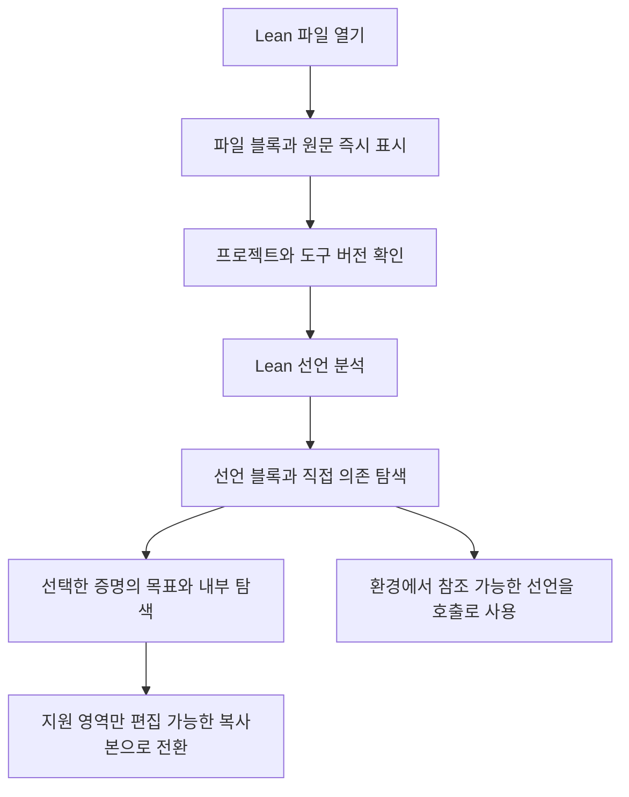

# GLEAN: 숨김·중첩 증명 컴포넌트·Lean 가져오기 계획

Copyright (c) 2026 GLEAN contributors. Released under Apache 2.0.

작성일: 2026-10-07. 상태: 구현 전 설계 제안. 현재 저장소를 읽고 root와 검토 에이전트 `oop_plan_review` 한 명이 논의했다. 이 문서의 새 기능과 수락 기준은 구현 완료를 뜻하지 않는다.

## 1. 우리가 만들려는 경험

**큰 수학 증명을 하나의 블록으로 다루고, 그 블록에 들어가면 보조정리와 계산이 다시 블록으로 보이는 GLEAN**을 만든다. 사용자는 지금 필요한 수준만 펼치고 나머지는 접거나 숨긴다. 블록의 외부에는 무엇을 가정하고 무엇을 증명하는지가 남아 있어야 한다.

**하나의 증명 컴포넌트는 긴 Lean 코드 본문 또는 여러 블록을 연결한 내부 그래프를 가질 수 있어야 한다.** 내부 그래프의 자식도 코드 블록이나 그래프 블록이 될 수 있다. 이 두 작성 방식을 동등한 기능으로 제공하고, 코드 블록을 파일 가져오기의 읽기 전용 화면으로만 취급하지 않는다. 외부에서는 두 방식 모두 같은 입출력 계약을 가진 한 블록으로 사용한다.

예를 들어 `Irrational.lean`을 열면 먼저 파일 블록과 원문이 나타난다. Lean 분석이 진행되면 파일 안의 선언들이 보이고, `irrational_pi : Irrational Real.pi`를 선택하면 하나의 증명 컴포넌트로 집중해서 볼 수 있다. 내부 탐색에서는 사용한 보조정리, 지역 증명, 실제 목표를 단계적으로 펼친다. 이미 프로젝트에서 사용할 수 있는 선언은 다른 증명에 호출 블록으로 배치한다.

기존 π 감사에 사용한 파일은 311줄이며 여러 선언을 포함한다. **파일 311줄 전체를 한 정리의 본문 또는 311개의 노드로 간주하지 않는다.** 파일 → 선언 → 선택한 증명 내부라는 탐색 계층을 제공한다. 원본과 실행 근거는 [π 감사 보고서](/Users/moonone/GLEAN/glean/research/2026-10-07-pi-audit/README.md)에 있다.

OOP에서 가져올 핵심은 **캡슐화, 명시적인 계약, 합성, 공유 정의와 개별 호출의 구분**이다. Lean의 타입·지역 문맥·증명 검사를 그대로 바탕으로 삼는다. 우선 구현할 상호작용은 다음 네 가지다.

1. **숨기기와 선택만 보기:** 선택을 감추거나 선택한 블록만 남기고, 숨긴 목록·격리 종료·오류 위치에서 다시 찾는다.
2. **접기와 내부 탐색:** 여러 블록을 한 경계로 접거나, 블록 안으로 들어간다.
3. **컴포넌트로 추출:** 선택한 증명 조각에 입력과 결과를 부여해 재사용한다.
4. **Lean 열기:** 파일을 즉시 표시하고, 실제 Lean 분석 결과를 점진적으로 붙인다.

## 2. 현재 기능과 새로 필요한 기능

다음은 2026-10-07 현재 로컬 코드 기준이다. 과거 π 감사에서 발견한 모든 문제가 지금도 그대로 남아 있다는 뜻은 아니다.

| 영역 | 현재 확인한 구현 | 이번 확장 |
|---|---|---|
| 시각 그룹 | v1/v2에 비중첩 그룹, 접기, 경계 포트, 그룹 이동 | 중첩·숨김을 공통 표현 계층으로 옮겨 v3에도 적용 |
| 함수 정의와 호출 | 공유 모듈 정의, 호출, 모듈 간 DAG, v3 타입 포트 | 정의 편집과 호출별 내부 탐색을 구분하고 탐색 경로 유지 |
| 블록의 코드 본문 | `LeanScript`의 term/`by` 본문, 서버 측 8,192바이트 한도 | 긴 본문을 직접 작성하는 코드 블록, 전용 편집기, 내부 오류 행 이동 |
| 함수 추출 | v1/v2에서 제한된 명제 그래프 추출 | v3의 의존 타입·지역 문맥을 닫는 컴포넌트 추출 |
| `.lean` 열기 | 소스 편집기, 실제 목표·지역 문맥, 소스 검사 | 원본을 가진 파일·선언 블록과 계층 탐색 |
| 선언 목록 | 주석·문자열을 가린 보수적인 텍스트 인덱스 | Lean이 확인한 이름·범위·타입·의존성 인덱스 |
| 기존 선언 참조 | 설치된 프로젝트의 import 환경에서 실제 타입 조회 | 원본 탐색 블록에서 참조 호출로 이어지는 명시적 경로 |
| 검증 상태 | 의미 변경과 일부 배치 변경을 분리 | 숨김·중첩·탐색 상태까지 의미 변경에서 분리 |
| 큰 그래프 | v3에 의미 노드 256개, 간선 512개, 모듈 32개 등의 한도 | 가져온 선언 탐색 모델을 편집 그래프와 분리하고 점진 렌더링 |

특히 v3 렌더러는 현재 v1/v2의 그룹 투영을 사용하지 않는다. 기존 그룹 UI에 `hidden`만 덧붙이면 버전별 동작이 갈라진다. 공통 표현 모델부터 만들 필요가 있다. 근거: [모듈 계약](/Users/moonone/GLEAN/glean/prototype/MODULES.md), [v3 계약](/Users/moonone/GLEAN/glean/prototype/TYPED_GRAPH.md), [v3 편집기](/Users/moonone/GLEAN/glean/prototype/web/typed-editor.mjs:25).

## 3. OOP를 증명에 적용하는 방식

| OOP 개념 | GLEAN에서의 대응 | 구체적인 동작 |
|---|---|---|
| 캡슐화 | Proof Component | 내부가 수십·수백 단계여도 외부는 입력 문맥과 결과 명제로 표시 |
| 인터페이스 | 타입이 있는 매개변수와 결과 | 데이터, 가정, 암묵 인자, 타입클래스 요구를 구별 |
| 합성 | 컴포넌트 내부의 다른 컴포넌트 호출 | 작은 보조정리를 조립해 큰 정리를 구성 |
| 정의와 인스턴스 | 공유 정의와 개별 호출 | 같은 보조정리를 여러 인자로 사용하고 각 호출의 문맥을 표시 |
| 제네릭 | 타입·값 매개변수와 universe | `n : Nat`에 따라 `Fin n` 포트 타입이 달라지는 계약 |
| 정보 은닉 | 내부 구현의 접기 | 내부는 접되 공개 가정, 결과, 검증 범위, 오류 요약은 확인 가능 |
| 패키지 | 프로젝트·모듈·네임스페이스 탐색 | 이름과 소속을 찾는 계층이며 증명 지역 범위와 구별 |

Lean의 매개변수 다형성과 타입클래스를 활용한다. 클래스 상속·가변 객체 상태·가상 메서드 호출을 새로운 증명 의미로 추가할 필요는 없다. 공통 요구 사항은 타입 매개변수와 타입클래스 계약으로 나타내고, 증명 재사용은 함수 적용과 합성으로 표현한다. 이는 Lean이 제공하는 다형성 방식과 맞는다. [Lean 공식 타입클래스 문서](https://lean-lang.org/doc/reference/latest/Type-Classes/).

화면에서는 개발 용어인 “클래스”보다 **증명 블록 / 함수 정의 / 호출 / 그룹**을 사용한다. 특히 Lean 타입클래스의 instance와 GLEAN의 호출 인스턴스를 같은 라벨로 혼동하지 않는다.

### 세 종류의 경계를 분리한다

| 종류 | 의미를 바꾸는가? | 경계에 있는 것 | 적합한 사용 |
|---|---|---|---|
| 시각 컨테이너 | 아니오 | 기존 연결을 표시하는 경계 소켓 | 배치 정리, 접기, 숨기기 |
| 증명 컴포넌트 | 추출·계약 편집 시 예 | Lean이 검사하는 입력·결과 계약 | 함수 정의, 재사용, 큰 증명 캡슐화 |
| 소스 블록 | 탐색만 하면 아니오 | 원본 선언과 확인된 메타데이터 | 임의의 Lean 파일을 손실 없이 열기 |

같은 카드 디자인을 쓰더라도 `그룹`, `공유 정의의 호출`, `원본 소스`를 구별한다. 그룹 경계에 포트가 보인다고 그것이 새 Lean 함수가 된 것은 아니다. 소스 선언이 카드로 보인다고 아직 편집 가능한 증명 그래프로 변환된 것도 아니다.

## 4. 숨김·접기·중첩 UX

### 숨기기와 접기

| 동작 | 화면 결과 | 소스·검증·연결 |
|---|---|---|
| 숨기기 | 카드 본문을 감추고 숨긴 목록에 등록 | 그대로 유지 |
| 선택만 보기 / 격리 | 선택 외 블록을 일시적으로 감추고 격리 상태 표시 | 그대로 유지; 기존 검사 범위·공리 정책 불변 |
| 접기 | 컨테이너 또는 컴포넌트를 한 카드로 표시 | 그대로 유지 |
| 내부 열기 | 해당 범위의 캔버스로 이동 | 탐색만으로 변경하지 않음 |
| 삭제 | 실제 블록을 제거 | 의미 변경, 영향받는 검사 결과 무효화 |

우클릭 및 선택 도구에 `선택 숨기기`, `선택만 보기`, `다시 표시`, `그룹으로 묶기`, `접기`, `내부 열기`를 둔다. 기존 UI와 충돌하는 단축키는 따로 지정하지 않는다. 전역 도구에는 `숨긴 항목 N개`, 검색, `수동 숨김 해제`를 둔다. 격리 종료와 수동 숨김 해제는 아래와 같이 구별한다. 키보드로 목록을 열고 항목에 이동할 수 있어야 한다.

- **연결이 있는 숨긴 블록:** 작은 숨김 경계 표시와 원래 연결의 정체성을 남긴다. A→B→C에서 B를 숨겼다고 A→C라는 새 증명선을 그리지 않는다. 여러 숨긴 블록을 하나의 표시로 모아도 실제 연결 목록을 열 수 있어야 한다.
- **연결이 없는 숨긴 블록:** 캔버스에서 완전히 감출 수 있지만 탐색 목록에서 찾을 수 있다.
- **오류가 있는 내부:** 상위 카드와 진단 목록에 오류 개수와 위치를 남긴다. 숨긴 최종 목표도 전역 목표 상태에서 빠지지 않는다.
- **진단으로 이동:** 필요한 조상 컨테이너를 임시로 펼치고 해당 블록을 읽을 수 있는 배율로 보여준다. 임시 표시를 끝내면 사용자의 숨김 설정으로 돌아간다. `계속 표시`를 선택하면 영구 설정을 바꾼다.
- **전체 증명과 자식 상태:** 최종 목표의 검증 상태, 자식 오류, 미완성 자식 수를 별도로 집계한다. 최종 목표가 검증되었다는 이유로 사용하지 않은 `sorry` 블록까지 초록색으로 칠하지 않는다.

숨김은 검사 생략 기능이 아니다. 현재 열린 문서에서 숨김·접기·배치·탐색을 바꿔도 생성 Lean 코드와 의미 해시는 같아야 하며, 그 이유만으로 Lean 재검사를 요청하지 않는다. 파일 재열기·새로고침 시에는 기존 신뢰 정책에 따라 검사 결과를 다시 확인한다.

숨김·접기·이동처럼 문서를 편집하는 화면 변경은 Undo/Redo에 기록한다. 단순 내부 이동·선택·확대율은 별도 탐색 이력과 복구 상태로 관리한다. Ctrl+Z가 방금 한 편집 대신 여러 번의 breadcrumb 이동만 취소하는 경험을 피한다.

### 선택한 블록만 보기 — CAD의 Isolate를 GLEAN에 적용

사용자는 여러 코드/그래프 블록을 선택한 뒤 **`선택만 보기` 한 번으로 나머지 블록을 감출 수 있어야 한다.** 영문 명령은 `Isolate Selected`로 검색할 수 있게 한다. 기본 동작은 다른 카드들을 실제로 감추는 것이며, 흐리게 표시하는 의존 미리보기와 구별한다.

참고한 공식 동작은 다음과 같다. 제품별 동작을 그대로 동일하게 복제한다는 뜻은 아니며, 아래 GLEAN 정책은 증명 편집에 맞춘 설계 결정이다.

| 참고 제품 | 확인한 동작 | GLEAN에 적용할 패턴 |
|---|---|---|
| AutoCAD LT 2026 | `ISOLATEOBJECTS`는 선택 외 객체를 임시로 감춤. `UNISOLATEOBJECTS`는 isolate/hide 명령의 영향을 받은 객체를 다시 표시 | 선택 기반의 빠른 격리와 명시적인 종료. GLEAN의 종료는 수동 숨김을 별도로 보존하도록 설계 |
| AutoCAD LT 상태 표시줄 | 숨기기·격리·종료 진입점과 격리 활성 상태 표시 | 캔버스를 최대화해도 남는 상태 표시와 종료 버튼 |
| Rhino 8 | `Hide`, `ShowSelected`, `Isolate`, `Unisolate`, `HideSwap` 제공. 문서상 Isolate에는 잠긴 객체를 남기는 예외가 있음 | 숨김 목록에서 골라 복원하기, 격리와 일반 숨김 구분. GLEAN의 선택만 보기에는 잠금/고정이라는 숨은 예외를 추가하지 않음 |

근거: [AutoCAD 2026 Isolate](https://help.autodesk.com/cloudhelp/2026/ENU/AutoCAD-LT/files/GUID-12C177FC-E8D1-44C0-9199-A9D46FC2DA39.htm), [AutoCAD 2026 Unisolate](https://help.autodesk.com/cloudhelp/2026/ENU/AutoCAD-LT/files/GUID-B21B3F6C-7F67-465A-A97E-5E8ADC87B6D4.htm), [AutoCAD 상태 표시줄](https://help.autodesk.com/cloudhelp/2022/ENU/AutoCAD-LT/files/GUID-39F3FBCE-9817-4566-98F2-842D602652FA.htm), [Rhino 8 표시 명령](https://docs.mcneel.com/rhino/8/help/en-us/commands/hide.htm).

#### 기본 작업 흐름

1. Shift 선택·영역 선택·탐색 목록으로 같은 캔버스 범위의 블록을 고른다. 선택 0개이면 `선택만 보기`를 비활성화하고 이유를 표시한다.
2. 우클릭의 `선택만 보기` 또는 캔버스 상단 눈 아이콘의 동일 명령을 실행한다. 실행 당시의 선택을 고정하며, 이후 다른 블록을 클릭한다고 격리 대상이 바뀌지 않는다.
3. 선택한 블록을 현재 범위에 남기고 다음 상태 막대를 표시한다. 범위 이름, 대상/숨김 개수, 진단을 텍스트로 읽을 수 있게 한다. 확대율은 유지하고 `선택에 맞추기`를 별도 제공한다.
4. `격리 종료` 한 번으로 이 캔버스의 모든 격리 단계를 종료한다. 격리 직전의 보기 상태로 돌아가되, 작업 중 실제로 편집한 코드·배치·수동 숨김 변경은 보존한다.

```text
[눈] 선택만 보기 · root / 호출 A · 2단계
대상 3개 · 격리로 숨김 18개 · 수동 숨김 2개 · 격리 밖 오류 1개
[선택에 맞추기] [대상 추가] [이전 격리로] [격리 종료]
```

이 막대는 도킹 패널을 닫거나 그래프를 전체화면으로 보더라도 남는다. 색·아이콘에만 의존하지 않고 텍스트와 키보드 접근을 제공한다. 상태의 “격리로 숨김”과 “수동 숨김”은 중복 집계하지 않으며 현재 캔버스 범위 기준이라고 표시한다. 접힌 자손은 별도의 내부 개수로 설명한다.

| 명령 | 정확한 효과 |
|---|---|
| 선택 숨기기 | 수동 숨김 값을 변경하는 문서의 표현 편집. Undo 가능 |
| 선택만 보기 | 선택 외 블록을 임시로 가리는 격리 단계를 시작. 이미 격리 중이면 한 단계 좁힘 |
| 이전 격리로 | 가장 최근 격리 단계 하나를 해제하고 이전 대상·보기로 복귀 |
| 격리 종료 | 현재 캔버스의 모든 격리 단계를 해제. 수동 숨김은 유지 |
| 수동 숨김 해제 | 현재 범위에서 사용자가 직접 숨긴 상태를 해제. 격리 중이면 격리는 유지된다고 버튼 옆에 표시 |
| 현재 캔버스 전부 표시 | 명시적인 보조 명령. 현재 범위의 격리 종료와 수동 숨김 해제를 함께 수행하며 접힘 상태는 유지 |
| 숨긴 항목 찾기 / 대상 추가 | 격리 밖 및 수동 숨김 항목을 목록에서 구별하고, 고른 항목을 현재 격리에 추가해 보여줌 |

`격리 종료`와 `전부 표시`의 효과를 같은 아이콘의 모호한 토글로 합치지 않는다. 두 단계 이상 격리했을 때만 `이전 격리로`를 강조한다. 같은 대상을 같은 옵션으로 다시 격리하면 중복 단계를 쌓지 않는다. Esc는 미완성 연결·드래그·메뉴·편집기 작업의 취소를 먼저 처리하며, 해당 작업이 없는 캔버스에서만 격리 한 단계 복귀로 사용한다. 전체화면 종료와 동시에 격리를 해제하지 않는다. 다른 단축키는 기존 명령과 충돌을 확인한 뒤 캔버스에 한정해 등록한다.

#### 기존 숨김·중첩·편집과의 관계

- **범위:** 기본은 현재 열린 캔버스/의미 범위다. 다른 함수 정의·Cases 분기·공유 호출 B의 표시 상태를 함께 변경하지 않는다. 부모에서 격리 후 자식 내부로 들어가면 부모 격리를 보관하고 자식의 보기 상태를 사용한다. 돌아오면 부모 상태가 복원된다. 문서 전역을 평평한 한 그래프로 만드는 격리는 제공하지 않는다.
- **선택의 단위:** code/graph 호출은 모두 하나의 선택 가능한 블록이다. 시각 컨테이너를 선택하면 소속 항목을 포함하되 기존 내부 숨김·접힘은 유지한다. 내부 자식만 고르면 조상은 이름과 경계만 필요한 만큼 표시한다. 다른 자식의 카드를 자동으로 펼치지 않는다.
- **수동 숨김 보존:** 격리는 기존 `hidden`을 대량으로 바꾸지 않는다. 격리 도중 수동 Hide/Show를 했다면 종료 후에도 그 변경은 유지한다. 진입 당시 hidden 스냅샷으로 덮어 복원하지 않는다. 숨긴 목록에서 명시적으로 선택한 대상을 격리하거나 추가하면 해당 대상만 임시로 표시하고 원래 수동 숨김 값은 유지한다.
- **편집:** 새 블록을 생성·붙여넣으면 현재 격리 대상에 추가해 즉시 보이게 한다. 실제 편집 Undo로 블록이 제거되면 대상 참조도 정리한다. 대상 삭제로 현재 단계가 비면 안내와 함께 이전 유효 단계로 돌아가며, 모두 비었으면 격리를 종료한다. 격리 종료가 삭제한 블록을 부활시키지 않는다. 대상이 존재하지만 모두 수동으로 숨겨진 경우에는 빈 상태 안내와 `격리 종료 / 숨긴 항목 찾기`를 제공하며 수동 숨김을 자동 해제하지 않는다.
- **단계와 추가:** 격리 단계는 전체 허용 대상 집합을 갖고 최상단 단계가 활성화된다. 여러 단계의 집합을 무조건 교집합으로 적용하지 않는다. 따라서 숨긴 목록에서 `대상 추가`한 항목이 앞 단계에 없다는 이유로 다시 사라지지 않는다. 이전 단계로 돌아가면 그 단계의 대상 집합으로 복귀한다.
- **진단:** 격리 밖 오류를 누르면 임시 표시 상태를 겹쳐 해당 위치로 이동한다. `격리로 돌아가기`로 원래 대상을 복원하며, `대상에 추가`를 누른 경우에만 현재 대상 집합을 바꾼다. 경계에서 감춰진 연결은 작은 소켓/개수로 남기고 실제 연결 목록을 열 수 있게 한다. A→숨긴 B→C를 가짜 A→C 증명선으로 바꾸지 않는다.
- **검사:** 격리는 화면만 바꾼다. 기존 검사 대상, 목표의 의존성, 커널 검사, 공리 정책을 바꾸거나 보이는 블록만 검사하는 모드로 전환하지 않는다. 격리 밖 오류·미완성 상태와 전체 목표 상태는 유지한다.
- **이력과 저장:** 격리 진입/복귀는 임시 탐색 이력이며 문서 Ctrl+Z를 소비하지 않는다. 수동 Hide/Show 등 표현 편집은 문서 이력에 기록한다. 일반 저장/내보내기에는 활성 격리를 기본 포함하지 않고, 새로 열면 수동 숨김만 복원한다. 세션 자동 복구 시에는 유효한 대상·범위를 확인하고 `이전 격리 복원`을 명시적으로 제공한다. `전부 표시`를 Undo하면 수동 숨김은 복원되지만 종료한 격리는 탐색 이력에서 별도로 돌아간다.

#### 증명 작업에 맞춘 관련 기능

| 기능 | UX 및 도입 범위 |
|---|---|
| 선택 + 필요한 입력 보기 | 기본 선택만 보기 옆의 옵션. 먼저 직접 입력 의존 블록을 추가하고 확장 개수를 표시. 더 이전 단계는 명시적으로 추가; P1 |
| 선택 + 사용처 보기 | 현재 의미 그래프에서 결과가 전달되는 직접 사용처를 표시. 정적 연결과 소스 참조를 구별하고 분석 미확정은 표시; P1 |
| 숨긴 항목 중 골라 표시 | Rhino의 선택 복원 패턴을 목록에 적용. 코드 내용 전체를 펼치지 않고 이름·종류·숨김 이유·오류로 검색; P0 |
| 보기 세트 저장 | 반복 검토할 블록 집합에 이름을 붙이는 후속 기능. 의미 범위·정의/호출 ID·표시 옵션을 저장하며 증명 검증 결과와 구별 |
| 선택 반전·표시/숨김 교환·주변 흐리게 보기 | 후속 고급 메뉴 후보. 기본 도구막대를 늘리지 않고, 잠깐 집중한다는 목적에는 선택만 보기를 우선 |

의존/사용처 보기를 켜도 수동 숨김을 조용히 해제하거나 전체 전이 의존성을 무제한으로 펼치지 않는다. 숨긴 의존 대상은 개수로 알려주고 명시적으로 현재 격리에 추가한다. 소스 탐색의 의존선은 편집 그래프의 포트 와이어와 계속 구별한다.

### 블록 안의 블록

시각 컨테이너는 **같은 의미 범위 안의 포함 트리**로 만든다. 한 항목의 부모는 하나이며 자기 포함·순환·중복 소속을 금지한다. 기존 비중첩 그룹은 루트 아래 컨테이너로 이전한다. 컨테이너 이동은 자식들의 화면 좌표를 함께 바꾼다.

Cases 분기, 지역 바인더, 함수 정의는 서로 다른 의미 범위다. 다른 분기의 블록을 드래그해서 한 그룹에 넣을 수 없다. 범위를 넘기는 작업은 가정·타입을 검사하는 명시적인 추출/리팩터링이어야 한다. 네임스페이스 트리 역시 이 지역 범위를 대신하지 않는다.

```text
π 무리성 파일                         파일 탐색
└─ irrational_pi                      선언 / 증명 컴포넌트
   ├─ 사용한 보조정리                  선언 의존 탐색
   └─ 증명 내부                        지원 범위에서 점진 분석
      ├─ 지역 가정과 have              지역 문맥을 가진 내부 항목
      └─ 계산 또는 경우 분기
         └─ 다른 증명 컴포넌트 호출    기존 정의 재사용
```

이 그림은 목표 UX이며, π 파일이 현재 이미 이 구조로 변환되었다는 뜻은 아니다.

기본 탐색은 **접힌 카드 → 내부 열기 → breadcrumb로 복귀**다. 복귀하면 이전 선택·확대율·스크롤 위치를 복원한다. 캔버스 안에서 내부를 미리 보는 기능은 처음에는 읽기 전용으로 제한한다. 깊게 펼친 전체 그래프를 항상 한 화면에 그리는 방식은 기본으로 삼지 않는다.

### 공유 정의와 개별 호출

같은 정의의 호출 A와 B는 다른 입력을 가질 수 있다. “공유 정의 편집”과 “호출 A 내부 보기”를 명확하게 구분한다. 예를 들어 정의의 일반 포트가 `i : Fin n`이면 A의 `n=3` 문맥과 B의 `n=5` 문맥을 섞지 않는다. 호출별 내부 타입을 아직 계산하지 못했다면 일반 정의와 실제 전달 인자를 따로 표시하고, 치환이 완료된 타입처럼 표시하지 않는다.

- `정의 편집`: 영향받는 호출 목록을 보여주고 모든 관련 호출의 검사 상태를 무효화한다.
- `호출 복제`: 같은 정의를 사용하는 새 호출을 만든다.
- `독립 정의로 복제`: 새 정의 ID를 만들고 이후 편집을 분리한다. 복제 시 중첩 호출을 계속 공유하는지 표시한다. 기본은 중첩 정의 공유다.
- `호출 숨기기`: 해당 호출만 숨긴다. 다른 호출이나 라이브러리의 정의는 숨기지 않는다.

현재 `scopePath()`의 `module/{id}`는 공유 정의를 식별한다. 이를 호출 경로로 재사용하면 A/B의 상태가 섞인다. **정의 ID, 의미 범위 ID, 호출 경로, 시각 컨테이너 ID를 별도로 둔다.** [현재 경로 구현](/Users/moonone/GLEAN/glean/prototype/web/typed-editor.mjs:18).

## 5. 재사용 가능한 증명 컴포넌트

컴포넌트의 공개 계약에는 이름, 순서 있는 매개변수, 결과 타입, 본문 방식, 프로젝트·환경 식별자, 검증 범위를 둔다. **작성 가능한 본문은 `code` 또는 `graph`다.** 외부 소스를 가져온 선언은 원문 참조와 확인된 계약으로 연결한다. 카드에는 우선 이름과 명제, 필요한 입력, 상태를 보여주고 상세 정보는 펼쳐 본다.

입력은 데이터와 가정뿐 아니라 타입·암묵 인자·타입클래스 요구를 포함한다. 생략해 표시할 수는 있어도 의미 모델에서 없애지 않는다. 어떤 타입클래스 인스턴스가 실제 사용되었는지는 Lean 결과로 확인한다. 표시 문자열이 같다는 이유만으로 포트 연결을 증명하지 않는다.

### 두 가지 본문과 혼합 구성 — 필수 요구사항

| 본문 방식 | 블록 안에 저장하는 것 | 내부를 열었을 때 | 다른 블록과 연결 |
|---|---|---|---|
| **코드 본문** | 사용자가 직접 작성·붙여넣은 여러 줄의 Lean term 또는 `by` 증명 | 검색·접기·행 번호·진단·목표 탐색을 갖춘 코드 편집기 | 공개 입력을 지역 이름으로 받고 코드 결과를 공개 출력으로 제공 |
| **그래프 본문** | 자식 블록들, 실제 연결선, 입력/결과 대응 | 편집 가능한 내부 캔버스 | 부모 입력을 내부 입력 블록으로 전달하고 선택한 내부 결과를 부모 출력으로 제공 |

`새 블록 → 코드로 작성 / 블록으로 구성`을 제공한다. 코드 블록은 원문이 없는 상태에서 새로 만들 수 있고, 그래프 블록도 빈 내부 캔버스에서 직접 구성할 수 있다. 기존 영역의 자동 추출이나 임의 Lean 코드의 자동 그래프 변환이 완성될 때까지 이 작성 기능을 미루지 않는다.

**그래프 본문 안에서 코드 블록과 그래프 블록을 함께 연결하고 재귀적으로 중첩한다.** 예를 들어 다음 구성 전체가 바깥에서는 하나의 블록이다. 화살표는 실제 타입을 가진 입출력 연결이며, 자식 목록을 단순히 표시하는 그룹과 다르다.

```text
큰 증명 블록 [그래프 본문]
  공개 입력
     │
     ▼
  A [긴 Lean 코드]
     │
     ▼
  B [그래프 본문]
     └─ 내부 입력 → B1 [Lean 코드] → B2 [그래프 본문] → 내부 결과
     │
     ▼
  C [Lean 코드] → 공개 출력
```

중첩의 깊이는 한 단계로 고정하지 않는다. 초기 수락 시험은 3단 이상으로 하고, 실제 자원·깊이 제한은 별도로 표시한다. 그래프 합성은 기존 호출 DAG 제약을 유지한다. 중첩할 수 있다는 이유로 재귀 호출이나 검사 한도 우회를 허용하지 않는다.

외부 블록은 부모의 공개 포트에만 연결한다. 부모 밖에서 내부 B1의 지역 변수나 포트로 직접 선을 꽂을 수 없다. 내부 값을 밖에서 쓰려면 부모 계약의 출력으로 명시적으로 내보낸다. 공개 포트는 안정적인 ID를 가지며, 내부 배치·숨김·코드 편집기를 여는 동작만으로 외부 연결이 끊어지지 않는다.

### 코드 블록을 직접 작성하고 편집하는 경험

1. 블록의 입력 이름·타입과 결과 타입을 지정하고, 긴 Lean 본문을 입력하거나 붙여넣는다. 외부 입력으로 선언하지 않은 지역 가정을 몰래 참조하지 않는다.
2. 카드에는 이름·계약·본문 줄 수·상태를 간결하게 표시한다. 수천 줄의 코드를 카드 높이로 펼치지 않고, `코드 열기`로 넓은 편집 영역에 들어간다. 코드 영역도 최대화하고 돌아올 수 있다.
3. 코드 안의 실제 오류 행·열 및 목표로 이동한다. 상위 그래프에서 오류를 눌러도 필요한 조상과 코드 편집기를 열어 해당 위치를 보여준다. 긴 본문의 첫 줄만 가리키는 진단은 완료 기준을 충족하지 않는다.
4. 본문 변경은 의미 변경이므로 해당 정의와 영향받는 상위 호출을 재검사 대상으로 만든다. 동일 계약을 유지하는 동안 공개 포트 ID·외부 와이어는 유지한다. 계약 변경 시에는 영향받는 연결을 표시한다.
5. 긴 코드·내부 연결·중첩 상태를 함께 저장하고 자동 복구한다. 코드 편집의 Undo와 캔버스 편집의 Undo는 초점과 작업 단위를 명확히 해 서로의 변경을 잘못 취소하지 않도록 한다.

**term 본문과 전체 Lean 파일을 구분한다.** 처음부터 직접 작성하는 코드 블록의 본문은 하나의 term/`by` 증명이다. 이 안에는 긴 `have`, `let`, 계산, tactic을 쓸 수 있다. `import`와 여러 최상위 선언을 포함한 파일은 전체 소스를 보존하고 내보낼 선언을 선택하는 별도 소스 단위다. 파일 전체를 term 슬롯에 그대로 넣지 않는다. 후자의 호출 연결은 6절의 프로젝트/작업용 모듈 조건을 충족해야 한다.

그래프 부모가 코드 자식과 그래프 자식을 연결하는 기능을 먼저 제공한다. 코드 본문에서 다른 GLEAN 그래프 정의를 이름으로 호출하는 기능까지 제공하려면 명시적 컴포넌트 의존성과 검사된 호출 이름 연결이 추가로 필요하다. 내부 생성 이름을 사용자 코드에 노출해 우회하지 않는다. 이 코드→그래프 호출 연결은 후속 범위이며, 초기에는 필요한 자식의 결과를 그래프에서 코드 블록의 입력으로 전달한다.

### 긴 코드의 실제 지원 범위

현재 본문은 [typed_graph.py의 기본 문자열 한도](/Users/moonone/GLEAN/glean/prototype/typed_graph.py:43)에 따라 8,192바이트까지이고, 생성 Lean 및 현재 소스 분석에는 128KiB 한도가 있다. 이 상태에서 편집기 크기만 키워 “매우 긴 코드 지원”이라고 표시하지 않는다.

P0-D의 **제안 수락 목표**는 단일 코드 본문 1MiB까지 저장·열기·편집·검사 요청 경로를 지원하는 것이다. 1,000줄/64KiB급과 10,000줄/1MiB급 fixture를 사용하고 실제 계산·지역 보조증명·호출을 포함한다. 공백이나 주석만 늘린 시험으로 완료하지 않는다. 이는 아직 측정된 지원 한도가 아니며 구현 시 공개할 자원 정책과 함께 검증해야 한다.

- 본문, 문서 JSON과 escaping 이후 요청, 생성 wrapper를 포함한 Lean 소스, LSP 응답, 저장/복구에 **서로 맞는 바이트 한도**를 정한다. 본문 1MiB를 허용하면서 전달·검사 단계에서 더 작은 한도로 막는 설계는 허용하지 않는다. 그래프 노드·간선 한도는 별도로 유지한다.
- 반복 호출할 때 긴 정의 본문을 호출 수만큼 복사하지 않는다. 정의는 저장·생성 시 공유하고 호출은 참조한다. 전체 문서 복제 위주의 Undo/자동 저장이 메모리를 과도하게 쓰지 않도록 본문 공유·편집 이력 구조를 검토한다.
- 코드 본문 내부 위치와 실제 검사 소스 사이의 정밀한 대응을 만든다. 현재 wrapper/구문 위치 처리를 그대로 써도 정확한 행·열로 이동하는지 독립 시험한다.
- 큰 입력도 검사 취소·시간 제한·진행 표시를 지원한다. 모든 코드가 정해진 시간 안에 검증된다고 약속하지 않으며, 제한에 도달하면 본문을 보존하고 검사 미완료 상태를 표시한다. 초과 입력을 자르거나 일부만 검사해 성공으로 표시하지 않는다.

### 본문 방식과 편집 기준

각 컴포넌트는 **현재 편집의 기준인 본문 하나**를 가진다. `code`의 기준은 Lean 코드이고 `graph`의 기준은 자식·연결 모델이다. 그래프의 생성 Lean 미리보기는 읽기 전용이다. 그래프 안에 코드 자식이 있으면 그 자식 코드는 정상적인 편집 대상이며, 이는 부모 전체를 코드로 바꾸는 것과 다르다.

동일한 공개 계약 아래 본문 방식을 명시적으로 바꿀 수 있도록 설계하되, 기존 본문을 보존하고 바뀐 구현을 실제 검사한다. 일반적인 코드→그래프 자동 변환은 지원 구간부터 제공한다. `코드 보기 / 그래프 보기`라는 탭을 전환한 것만으로 두 표현이 양방향 동기화된다고 약속하지 않는다. 코드와 그래프를 섞어 작성하는 필수 기능은 이 자동 변환에 의존하지 않는다.

### 선택 영역을 컴포넌트로 추출하는 절차

1. 같은 의미 범위에 있는 연결된 선택을 받는다. 외부 입력과 외부에서 사용되는 결과를 찾는다.
2. 포트 타입과 본문이 참조하는 지역 문맥까지 조사해 **입력의 의존성을 닫는다**. 입력 목록과 순서를 사용자에게 미리 보여준다.
3. `i : Fin n`이 필요하면 `n : Nat`을 앞에 포함한다. 타입클래스, universe, 지역 let의 값과 타입, 분기 내부 증인도 분석한다. 이름만 복사하지 않는다.
4. 선택을 한 호출로 치환했을 때 새로운 순환이 생기는지 검사한다. 경계 밖으로 나갔다가 다시 들어오는 연결 때문에 DAG가 깨지는 추출을 거부한다.
5. **P2-A는 명제 하나의 증명을 반환하는 결과(`p : P`, `P : Prop`)부터 지원한다.** Nat/Fin 등 데이터 입력은 허용하며, 동일하게 닫힌 입력 문맥 아래 같은 명제를 증명하는지 검사한다. 다중 결과는 결과 사이의 의존성과 Prop/Type 구분을 보존하는 패키징 설계를 별도 검증한다. 모든 결과를 무조건 단순 튜플로 만들지 않는다.
6. 새 정의와 호출을 생성하고, 추출한 계약과 원래 외부 목표에 대한 Lean 검사 및 기존 커널·공리 정책 검사를 실행한다. 실패하면 원본을 유지하고 이유를 보여준다.

**데이터 결과는 같은 타입이라는 사실만으로 추출의 의미가 보존되지 않는다.** 예를 들어 Nat 값 3을 5로 바꿔도 타입은 같다. 데이터 반환 추출은 P2-B에서 같은 닫힌 문맥의 원래 결과와 새 호출 결과에 대해 definitional equality 또는 Lean이 검사한 적절한 동치 증명을 확인하는 게이트를 둔다. 이를 확인할 수 없다면 자동 추출을 지원하지 않는다고 표시한다. 기존 데이터 블록과 수동 모듈 작성 기능은 유지한다.

분기 안에서 추출한 함수를 같은 분기에서 호출하는 것은 가능한 후보지만, 지역 증인을 형제 분기로 이동시키는 것은 별개 문제다. MVP는 지원하지 못하는 지역 구조·다형 시그니처를 명확한 진단으로 남긴다. 기존 `LeanScript` 및 원본 탐색을 유지한다.

## 6. Lean 코드를 즉시 가져오는 경로

**즉시 표시와 즉시 검증은 별도의 목표다.** 사용자가 파일을 선택하면 원문이 보이는 파일 블록을 먼저 만든다. Lean 프로세스 준비와 elaboration을 기다리느라 빈 캔버스를 보여주지 않는다. 현재 `.lean` 파일 가져오기를 이 경로로 확장한다.



### 분석 상태와 원본 보존

파일 상태는 `원문 열림 → 환경 준비 → 분석 중 → 분석 완료 / 일부 분석 / 환경 오류`로 표시한다. **원문을 열었다는 사실, 선언을 찾았다는 사실, 목표가 검증되었다는 사실을 서로 다른 상태로 다룬다.** 에러가 있는 파일도 원문과 확인 가능한 일부 선언을 볼 수 있어야 한다.

파일 전체를 원본으로 보존한다. 정리 본문만 잘라 새 LeanScript로 붙이면 앞선 notation, macro, namespace/open, section 변수, local instance, 속성, 옵션의 영향을 잃을 수 있다. Lean의 section은 여러 명령에 걸쳐 변수와 설정의 문맥을 유지한다. [Lean 공식 네임스페이스·섹션 문서](https://lean-lang.org/doc/reference/latest/Namespaces-and-Sections/).

가져오기만 하거나 화면 배치를 바꾸면 원본 파일의 바이트·주석·개행을 그대로 보존한다. 기존 JSON의 정규화된 문자열만으로 이 약속을 충족하는지 확인하고, 필요하면 원본 바이트 스냅샷을 별도로 둔다. 검증할 텍스트와 원본 스냅샷의 연결도 기록한다. 소스를 직접 수정하면 새 버전으로 분석하고 기존 결과는 오래된 상태로 바꾼다.

### 선언 목록과 실제 의미

현재 텍스트 선언 목록은 빠른 임시 개요로만 사용한다. `추정 목록`임을 표시한 뒤, Lean이 제공하는 실제 이름·원본 위치·시그니처로 교체한다. namespace, private 이름, 다중 선언 명령, 매크로가 생성한 선언 때문에 줄 단위 정규식 결과를 정확한 의미 구조로 취급하면 안 된다. 근거: [현재 임시 인덱스](/Users/moonone/GLEAN/glean/prototype/lean_lsp.py:99).

선언 블록에는 선언 종류, 실제 이름, 선언된 명제/타입, 명시·암묵·타입클래스 입력, 원본 이동, 분석 환경을 붙인다. 실제 공개 포트는 Lean이 확인한 telescope, 즉 앞 인자에 의존할 수 있는 순서 있는 인자 목록을 따른다.

**P1 시작 게이트:** 현재 문서의 Lean snapshot/명령 분석에서 실제 선언·범위·직접 의존성을 얻는 adapter PoC를 먼저 통과한다. namespace, private, macro 생성 선언, 일부 오류가 있는 파일을 시험한다. 기존 설치 환경의 `declaration.py` 조회만으로 현재 파일 분석 전체가 해결된다고 가정하지 않는다. 분석하지 못한 항목은 원문과 미확정 상태로 유지하며, 해당 adapter가 실패하면 P1 완료 판정을 보류한다. P3의 tactic 내부 adapter는 이후의 별도 게이트다.

처음에는 선택한 선언의 **직접 의존성**만 펼친다. 정리 하나가 참조하는 라이브러리의 전체 전이 의존성을 자동으로 화면에 펼치지 않는다. 실제 상수 의존선, 소스 참조선, 목표 변화선, 편집 가능한 증명 포트 연결선을 서로 다른 범례와 동작으로 구별한다. 의존성 인덱스에 mutual/recursive 선언이 있으면 탐색에서는 묶어 표시할 수 있지만, 현재 편집 모듈 DAG에 순환 호출을 허용했다는 뜻은 아니다.

### 가져온 선언을 다른 증명에서 쓰는 조건

| 입력 경로 | 바로 할 수 있는 일 | 호출 컴포넌트로 쓰기 위한 조건 |
|---|---|---|
| 현재 지원 프로젝트의 기존 모듈 | 원본·선언·의존 탐색 | 실제 모듈 import와 공개 선언 조회, 현재 지원 시그니처, Lean 재검사 |
| 업로드한 단독 파일 | 원문 표시와 해당 문서의 분석 | 파일을 올렸다는 이유만으로 프로젝트 환경에 선언이 등록되지는 않음 |
| 다른 Lake 프로젝트 | 원문을 먼저 표시 | 프로젝트 루트·toolchain·패키지 환경을 연결하는 추가 지원 필요 |

현재 프로파일은 `glean`과 `mathlib`, 도구 버전은 Lean 4.34.1에 고정되어 있다. 기존 선언 조회는 설치된 import 환경을 사용한다. 따라서 “카드로 가져오기”와 “다른 증명에서 호출하기”의 완료 기준을 나눈다. [프로젝트 프로파일](/Users/moonone/GLEAN/glean/prototype/lean_project.py:12), [선언 조회](/Users/moonone/GLEAN/glean/prototype/declaration.py:49).

단독 파일의 새 정리를 재사용하려면 전체 소스를 보존한 작업용 모듈을 실제 환경에서 컴파일하고 참조하는 연결 기능이 필요하다. 이는 별도 PoC를 통과한 뒤 제공한다. 정리 본문을 `axiom`이나 `sorry`로 바꿔 포트만 만들어 놓고 재사용에 성공했다고 표시하지 않는다. private·지역 선언은 탐색 가능 여부와 외부 호출 가능 여부를 따로 표시한다.

### 어느 표현이 편집의 기준인가

- **원본 소스 기준:** 가져온 파일의 Lean 소스가 기준이다. 블록 배치와 숨김은 별도 GLEAN 데이터에 저장한다. 처음에는 생성된 구조를 탐색하며, 증명 변경은 소스 편집으로 수행한다.
- **그래프 기준:** graph 본문을 가진 GLEAN 컴포넌트는 내부 그래프가 기준이며 Lean을 생성한다.
- **직접 작성한 코드 본문 기준:** GLEAN 코드 블록은 사용자가 작성한 본문이 기준이다. 같은 문서의 그래프 안에 코드 본문을 가진 자식이 존재할 수 있다. 따라서 편집 기준은 최상위 문서뿐 아니라 각 컴포넌트에 명시한다.
- **편집 가능한 복사본 만들기:** 지원되는 구간만 명시적으로 변환한다. 원본을 유지하고, 필요한 전체 문맥과 목표를 보존한 별도 결과를 Lean으로 검사한다. 검사 실패·지원 불가는 전환 실패로 표시한다.

두 표현을 동시에 수정하며 자동으로 양방향 동기화하는 기능은 초기 범위에 넣지 않는다. 지원하지 않는 tactic이 있으면 본문을 보존한 소스 블록으로 남긴다. 어떤 변환이 원래 증명과 같은 명제를 증명하는지, 실제 문맥을 보존하는지는 검사 결과로 보여준다.

## 7. 내부 증명은 얼마나 자동으로 펼칠 수 있는가

최초 릴리스에서 모든 Lean 코드가 Grasshopper의 편집 가능한 데이터 흐름 그래프로 자동 변환된다고 약속하지 않는다. 다음 순서로 자세해지는 탐색을 제공한다.

1. **선언 수준:** 파일에 어떤 정리·정의가 있고 무엇을 직접 참조하는지.
2. **지역 증명 수준:** 선택한 `have`, `calc`, `cases` 등의 소스 범위와 지역 문맥.
3. **목표 변화 수준:** 특정 tactic 전후의 실제 목표와 가정.
4. **편집 수준:** 현재 컴파일러가 정확히 표현할 수 있는 부분의 그래프 전환.

Lean의 InfoTree/TacticInfo에는 tactic 전후의 목표 및 metavariable 문맥 정보가 존재한다. 그러나 이것이 곧바로 수학적으로 읽기 좋은 보조정리 계층이거나 GLEAN에 완성된 공개 API가 있다는 뜻은 아니다. 현재 고정 버전에서 읽기 전용 adapter를 먼저 실험한다. [로컬 Lean 자료형](/Users/moonone/GLEAN/src/Lean/Elab/InfoTree/Types.lean:151), [InfoTree API 문서](https://leanprover-community.github.io/mathlib4_docs/Lean/Elab/InfoTree/Types.html).

매크로가 펼쳐진 내부 단계와 사용자 소스 범위가 일대일로 대응하지 않을 수 있다. 대응이 확인되지 않은 단계는 추정 선을 그리지 않고 원문과 관측 결과로 남긴다. goal ID와 지역 변수 ID는 세션·문서 버전 안의 관측 식별자이며 영구 포트 ID가 아니다. AI가 제안하는 수학적 묶음은 이후 선택 기능으로 두고 Lean이 관측한 구조와 구분한다.

## 8. 데이터 구조와 구현 경계

### 세 모델을 연결하되 분리한다

| 모델 | 책임 | 저장·검사 원칙 |
|---|---|---|
| 의미 그래프 | 실제 포트, 연결, 지역 범위, 공유 정의와 호출 | 컴파일러 입력과 의미 해시의 기준 |
| 화면 표현 | 컨테이너 트리, 숨김·접기, 위치, 탐색 경로 | 편집은 Undo, 이동·선택은 탐색 이력; 저장/복구하되 증명 의미 해시에서 제외 |
| 소스 분석 | 원본 스냅샷, 선언 인덱스, 관측된 의존성·목표 | 소스·환경·adapter 버전에 종속된 결과 |

권장 방향은 **v3 의미 그래프를 유지하면서 문서 바깥층에 버전 있는 `presentation`과 컴포넌트 작성 모델을 추가**하는 것이다. 코드 본문은 초기에는 기존 script/모듈 표현으로, 그래프 본문은 기존 모듈로 명시적으로 변환할 수 있는지 검토한다. 의미 변경을 presentation에 넣지 않는다. 장기적으로 본문 유형을 의미 스키마에 직접 추가한다면 명시적인 스키마 버전 이전이 필요하다. 다음 이름은 제안이며 현재 존재하는 API 계약은 아니다.

```text
document
  content: 전체 Lean 소스 스냅샷 또는 컴포넌트 정의/호출
  components[id]:
    interface: 순서 있는 입력, 결과 타입, 안정적인 포트 ID
    body: code {text} | graph {nodes, edges, inputs, result}
    authority: code | graph
    sourceOrigin: 가져온 소스가 있다면 원본과 선언/환경 참조
  presentation: version, containers, hidden, collapsed, occurrenceViews
  analysisIdentity: source/graph hash, project, toolchain, environment, adapter version
  analysisCache: 확인된 identity에 종속된 sourceMap/진단/타입 정보
runtime
  sessionView: scope/occurrence별 isolationStack, 임시 진단 표시, 복귀 viewport
```

가져온 선언 인덱스와 InfoTree 전체를 v3 `nodes` 배열에 넣지 않는다. 무거운 분석 결과는 재생성 가능한 캐시로 두고, 저장 파일에는 원본과 필요한 사용자 표시 상태를 남긴다. 가져온 저장 파일에 기록된 초록색 상태를 신뢰하지 않고 현재 환경에서 유효성을 확인한다.

`sessionView`는 문서와 별도의 실행 중 상태이며 일반 문서 내보내기에서 제외한다. 격리 프레임은 scope/occurrence ID, 실행 당시 대상 ID, 명시적으로 추가한 대상, 임시 숨김 해제 대상, 이전 viewport를 갖는다. 렌더러는 현재 문서의 유효 ID → 수동 숨김 → 활성 격리 대상 → 명시적 임시 표시 → 접힌 경계의 순서로 화면을 계산한다. 격리 중 수동으로 숨긴 항목은 해당 범위의 모든 프레임과 진단의 관련 임시 표시에서도 제거해 최신 사용자 동작을 반영한다. 어떤 단계도 실제 노드·간선·소스 내용을 삭제하거나 의미 해시에 들어가지 않는다.

### 먼저 지켜야 하는 불변식

1. **검증 식별자:** 소스/그래프 내용, 실제 import·인스턴스·옵션 등 환경, toolchain, adapter, 검사 정책과 범위를 함께 고려한다. 직접 참조한 상수 이름 목록만으로 환경을 대신하지 않는다.
2. **표현 제외:** `hidden`, 부모 컨테이너, 탐색 경로가 의미 해시나 컴파일 입력에 섞이지 않게 명시적인 변환기를 둔다. 기존 `semanticScope()`는 `groups`와 `x/y`만 제외하므로 그대로 확장하면 안 된다. 서버 측도 같은 경계를 유지한다. [현재 의미 해시](/Users/moonone/GLEAN/glean/prototype/web/history.mjs:19).
3. **표현 검증:** 순환 부모, 다른 범위의 자식, 존재하지 않는 ID, 중복 소속을 파일 열기 시 검사한다. 손상된 표현은 진단 후 복구하거나 제외하되 증명 원문을 버리지 않는다.
4. **출현 식별자:** 정의 ID와 호출 경로를 나누고, 화면 상태는 필요한 경우 호출별로 보관한다. 호출 A의 실제 인자·검사 결과를 B에 재사용하지 않는다.
5. **원본 위치:** 소스 hash·문서 버전과 위치를 함께 저장한다. 수정 후 이름·구문·주변 문맥으로 위치를 다시 대응시키되 애매하면 연결 미확정으로 표시한다. 줄 번호만 맞춰 과거 결과를 붙이지 않는다.
6. **비동기 응답:** 문서/환경 변경과 새 가져오기 이후 이전 분석 응답을 버린다. 진행 상태·취소·실패·재시도를 보여준다.
7. **규모:** 보이는 범위만 렌더링하고 내부는 필요할 때 읽는다. 가져온 1,000개 선언을 탐색할 수 있다는 것과 256개 제한의 편집 그래프를 컴파일할 수 있다는 것을 구별한다.
8. **이전 문서:** v1/v2 그룹·v3 문서의 열기/저장, Undo/Redo, 자동 복구를 함께 이전한다. 변환 전 원본을 유지하고 버전 불일치는 설명한다.

### 변경 지점

| 기존 위치 | 계획 |
|---|---|
| `web/model.mjs`, `web/typed-model.mjs` | 공통 컨테이너 모델, 범위·포트 대응, v3 추출 경계 |
| `web/typed-editor.mjs`와 기존 그래프 렌더러 | 공통 화면 투영, 숨김 경계, breadcrumb, 정의/호출 탐색, code/graph 본문 작성 |
| `web/history.mjs`, `web/document.mjs` | 의미/표현 분리, 문서 형식 이전, 긴 본문을 포함한 원본 보존·복구·Undo |
| `web/lean-editor.mjs`, `lean_lsp.py` | 즉시 파일 블록, 분석 상태, 버전 있는 원본 탐색 |
| `declaration.py`, `lean_project.py` | 실제 선언 의미·프로젝트 환경 연결, 호출 가능 조건 |
| `typed_graph.py` | 추출된 계약과 지역 범위 검사, 기존 커널·공리 검사 유지 |
| `server.py`, `source_check.py`, `lean_lsp.py`와 코드 편집기 | 긴 본문의 전달·검사·저장 한도 정합성, 정밀한 오류 위치, 취소와 자원 제한 |
| 새 공통 표현 모듈·Lean 분석 adapter | 작은 별도 모듈로 추가하는 제안; 함수·RPC 이름은 PoC 후 확정 |

Lean 커널 자체를 먼저 수정할 필요는 없다. GLEAN 편집기와 고정 Lean 버전의 분석 연결을 우선 확장한다. 온라인 `latest` 문서는 개념 참고이며, 구현 API의 근거는 현재 로컬 버전과 실제 실험이다.

## 9. 구현 순서와 각 단계의 완료 조건

| 단계 | 사용자에게 생기는 기능 | 선행 조건 및 완료 조건 |
|---|---|---|
| **P0-A: 표현 기반** | 숨기기/다시 표시, 선택만 보기·이전 격리/종료, 중첩 그룹, 숨긴 오류 위치 이동 | 공통 표현 검증·이전·의미 해시 분리. 격리와 수동 숨김·Undo/복구 구분, v1/v2/v3 수락 |
| **P0-B: 그래프 본문 작성·탐색** | 내부에서 자식 블록을 만들고 연결, 그래프 블록을 여러 단계 들어가고 돌아오기 | 기존 module DAG 활용. 부모 공개 포트와 내부 결과 연결, 정의/호출 문맥 구분 |
| **P0-C: 즉시 파일 열기** | `.lean`이 파일 블록과 원문으로 즉시 나타남 | 파일 보존, 임시 개요와 분석 상태. 이 단계에서 자동 편집 그래프 변환을 주장하지 않음 |
| **P0-D: 긴 코드 본문과 혼합 구성** | 긴 코드를 직접 작성·붙여넣는 블록, code/graph 자식 혼합, 코드 오류 행 이동 | 전체 경로의 크기 정책, 코드 편집기와 소스 위치 대응, 3단 혼합 그래프와 긴 본문 저장/검사 수락 |
| **P1: 선언 기반 탐색** | 실제 선언 카드, 직접 의존 탐색, 선택+입력/사용처 격리, 원본 이동, 가능한 기존 선언 재사용 | 현재 파일의 명령/snapshot adapter PoC 통과. 현재 지원 프로젝트부터 원문·환경 일치 확인 |
| **P2-A: v3 증명 추출** | 선택한 증명을 함수로 만들기, 공유 호출과 독립 복제 | 의존 문맥 폐쇄·순환 검사·실제 Lean 검사. 입력은 데이터도 허용, 결과는 단일 Prop |
| **P2-B: 추출 확장** | 데이터 반환 및 다중 결과의 추출 | 원래 값과 호출 결과의 의미 보존, 의존 결과 패키징을 별도 검증 |
| **P3: 선택한 증명 내부 탐색** | `have`/`calc`/`cases` 및 tactic 전후 목표의 점진 탐색 | 고정 버전 adapter PoC, 소스 대응, 지역 범위 유지. 지원 구간만 편집 전환 |
| **후속 확장** | 단독 업로드 정리의 재사용, 다른 Lake 프로젝트, 코드 본문에서 그래프 정의 호출, 더 일반적인 다형 계약 | 작업용 모듈 연결·검사된 컴포넌트 호출 연결·프로젝트/도구 버전 지원을 각각 검증한 뒤 제공 |

**첫 릴리스 목표는 P0-A/B/C/D + P1이다.** 사용자는 긴 코드 블록을 직접 만들고, 여러 블록을 연결한 그래프 블록 안에 코드/그래프 블록을 섞어 넣으며, 이를 숨기고 중첩 탐색할 수 있어야 한다. 실제 Lean 파일의 선언 탐색도 포함한다. 새 v3 자동 추출·지원 구간의 소스→편집 그래프 전환은 P2/P3 범위다. 수동 코드/그래프 작성과 혼합 구성은 P3까지 미루지 않는다. P0-C의 파일 껍데기만으로 “Lean 그래프 가져오기 완료”를 선언하지 않는다.

기존 공유 모듈 탐색을 P0에 둔 이유는 현재 구조에서 이미 가능한 “블록 안의 블록”을 먼저 사용할 수 있게 하기 위해서다. 일반적인 v3 추출보다 구현 위험이 낮으며 이후 추출 결과의 탐색 UI도 재사용할 수 있다.

각 단계는 작은 실패 테스트 → 구현 → 요구사항/설계 검토 → 수정 → 실제 Lean 및 UI 확인 순으로 진행한다. 이 문서는 계획 단계이므로 제품 테스트 통과나 새 기능 구현 완료를 보고하는 문서가 아니다.

## 10. 수락 시나리오

| ID | 단계 | 시험 | 통과 조건 |
|---|---|---|---|
| H01 | P0 | A→B→C에서 B 숨김 | 실제 간선·생성 코드·의미 해시 동일, 가짜 A→C 증명선 없음 |
| H02 | P0 | 숨긴 오류·최종 목표의 진단 클릭 | 전역 상태 유지, 조상을 임시로 펼쳐 읽을 수 있는 배율로 이동 |
| H03 | P0 | 3단 컨테이너 접기·숨김·이동 후 Undo/재열기 | 실제 endpoint, 숨김 설정, 배치·탐색 상태 일관성 |
| H04 | P0 | Cases 형제 분기 간 포함·연결 이동 | 시각 조작으로 지역 가정이 탈출하지 않음 |
| H05 | P0 | 한 정의의 호출 A/B에서 서로 다른 인자로 내부 탐색 | 일반 정의와 호출별 인자를 구별, A의 타입·선택·숨김이 B에 잘못 적용되지 않음 |
| H06 | P2 | 공유 정의 수정, 이후 독립 정의로 복제 | 공유 시 모든 관련 호출 재검사, 독립 복제 후 원본은 의미 불변 |
| H07 | P2 | `n : Nat`, `i : Fin n`을 쓰는 조각 추출 | n이 먼저 매개변수화, 실제 타입 검사, 빠진 지역 문맥 진단 |
| H08 | P2 | 외부로 나갔다 다시 들어오는 선택, 분기 증인 추출 | 호출 치환 순환 및 허용되지 않은 범위 탈출 거부, 원본 유지 |
| H09 | P2 | Nat 결과를 같은 타입의 다른 값으로 바꾸는 잘못된 추출 | P2-A에서는 데이터 반환 추출을 거부; P2-B에서는 의미 보존 검사로 거부 |
| V01 | P0-A | A/B/C 중 A·C를 선택만 보기 | B 카드 숨김, 선택 변경만으로 대상 불변, 실제 간선·소스·검사 범위 동일 |
| V02 | P0-A | 수동 숨김 → 격리 → 추가 Hide/Show → 격리 종료 | 기존 및 격리 중 수동 변경 보존, 진입 시 스냅샷으로 덮어쓰지 않음 |
| V03 | P0-A | 두 단계 격리, 같은 선택 반복, 한 단계/전체 종료 | 중복 프레임 없음, 이전 대상/viewport 복귀, 현재 캔버스만 종료 |
| V04 | P0-A/B | 호출 A 격리 후 내부 탐색·자식 격리·부모 복귀·호출 B 열기 | 부모/자식/호출별 상태 분리, 컨테이너 선택은 유효한 실제 대상에 매핑 |
| V05 | P0-A | 격리 밖 오류 클릭 후 복귀 | 임시 표시와 정확한 위치 이동, 원래 격리 보존, 경계 연결·전역 오류 요약 유지 |
| V06 | P0-A | 선택 없음·모든 대상 삭제·생성/붙여넣기·편집 Undo | 빈 선택 무동작, 빈 단계 안전 종료, 새 블록 즉시 표시와 삭제 ID 정리 |
| V07 | P0-A | 숨긴 목록에서 추가→다시 Hide, 수동 숨김 해제/전부 표시 | 추가 항목은 이전 필터에 숨지 않지만 최신 Hide는 임시 표시를 해제, 전부 숨김 시 탈출 UI 유지, 수동 숨김·격리 종료의 효과 구별 |
| V08 | P0-A | 코드 편집기·미완성 연결·전체화면에서 Esc, 키보드 격리 종료 | 작업 취소 우선순위 유지, 이중 해제 없음, 상태 막대와 종료에 항상 접근 가능 |
| V09 | P0-A | 격리 중 저장/재열기·세션 복구·Ctrl+Z | 일반 파일은 활성 격리 없이 열림, 복구는 명시적 재개, 격리가 문서 Undo를 소비하지 않음 |
| V10 | P1 | 선택+입력/사용처 격리, 수동 숨긴 의존 블록, 미확정 소스 참조 | 관계 종류·추가 개수·미확정 표시, 명시적 확장, 임의의 증명 와이어 생성 없음 |
| B01 | P0-D | 새 코드 블록에 기존 8KiB를 넘는 실제 Lean 본문 직접 입력/붙여넣기 | 64KiB급과 1MiB급의 원문 저장·복구·편집·검사 경로 확인, 정상 fixture 실제 검사와 잘못된 마지막 단계 거부 |
| B02 | P0-B/D | 그래프 부모 안에 code 자식과 graph 자식, 그 안에 code 손자를 연결해 3단 이상 구성 | 내부 실제 연결이 부모 입력/결과로 이어지고 전체 목표를 Lean으로 검사 |
| B03 | P0-D | 긴 코드 최하위 블록의 중간·끝부분에 오류 삽입 | 상위 진단 클릭 시 해당 조상과 편집기를 열고 정확한 행·열에 도달 |
| B04 | P0-B/D | 혼합 블록 저장/복구, 내부 코드 수정, 숨김 | 저장/복구·숨김은 본문 hash 보존, 코드 수정은 hash 변경; 계약 불변 시 공개 포트 ID·외부 와이어 유지, 의미 편집만 영향받는 상위 검사 무효화 |
| B05 | P0-B | 부모 외부에서 내부 자식 포트로 직접 연결 시도 | 경계 우회 거부, 필요한 값은 부모 공개 포트로 노출하도록 안내 |
| B06 | P0-D | 많은 호출이 하나의 긴 코드 정의를 공유하고 편집 Undo·취소 수행 | 정의 본문 중복 폭증 없이 응답성·메모리 측정, 취소/한도 초과에도 본문 보존 |
| I01 | P0/P1 | π 311줄 파일 열기 | 즉시 원문/파일 블록, 원본 hash 유지, 분석 전 검증 완료 표시 없음 |
| I02 | P1 | namespace·section·notation·macro·instance가 있는 파일 | 실제 이름·타입·위치 확인, 텍스트 추정과 구별, 원문 문맥 유지 |
| I03 | P1/P3 | 지원하지 않는 tactic, 중간 오류가 있는 파일 | 본문 누락 없이 탐색, 일부 분석과 목표 검증 구별 |
| I04 | P1 | 새 업로드 선언과 설치된 공개 선언을 각각 호출 시도 | 전자는 호출 가능 조건을 설명, 후자는 실제 import 및 Lean 검사로 확인 |
| I05 | P0–P3 | 소스/프로젝트 변경 도중 이전 분석 완료 | 과거 결과를 새 문서·환경에 붙이지 않음 |
| I06 | P1 | π 원본과 최종 증명 단계를 잘못 고친 변형 | 원본은 해당 정책으로 검사, 잘못된 증명은 거부, 숨김·접기와 무관 |
| I07 | P1/P3 | 상수 의존선·목표 변화선·실제 포트 연결 비교 | 의미·범례·클릭 동작 구별, 미확정 소스 대응을 사실처럼 표시하지 않음 |
| I08 | P0 | UTF-8 BOM·CRLF·Unicode 주석 파일을 열고 숨김/배치/저장/복구/원문 내보내기 | 소스를 편집하지 않았을 때 원본 바이트 hash 동일, 디코딩 실패는 명시 |
| S01 | P1 | 1,000개 선언 인덱스와 직접 의존 탐색 | 선택 범위 점진 렌더링, 기존 의미 그래프 한도 보존, 조작 지연 측정 |
| S02 | P0 | v1/v2/v3 저장 문서와 손상된 표현 메타데이터 열기 | 호환 이전·진단·원본 보존, 재열기는 기존 정책에 따라 미검증 상태에서 확인 |
| S03 | P0 | 현재 열린 문서에서 숨김 후 내부 이동·선택·Undo | 숨김만으로 Lean 재검사하지 않음, Ctrl+Z는 숨김 편집을 취소하고 탐색은 별도 이력 |
| S04 | P3 | 큰 증명에서 선택한 tactic 내부의 목표 탐색 | 범위별 점진 분석, 취소 가능, 이전 문서 목표 결과를 재사용하지 않음 |

성능은 처음부터 측정한다. **제안 목표:** 로컬에서 π 파일을 선택한 뒤 파일 블록과 원문을 보여주기까지 1초 이내. 이 시간에 Lean 검증 완료는 포함하지 않는다. 준비된 서버와 최초 실행을 나누고 각 조건을 반복 측정해 중앙값·p95와 파일 크기를 기록한다. 아직 측정된 성능 수치가 아니다. 긴 본문은 P0-D에서 기존 8KiB/128KiB 한도를 포함한 전체 경로를 함께 확장·검증한다. 그 전까지 현재 한도를 명시하고, 확장 후에도 공개된 한도 초과를 잘린 정상 결과로 보여주지 않는다.

실사용 비교는 같은 π 파일로 ① 최종 정리 찾기 ② 직접 사용하는 보조정리 찾기 ③ 관심 없는 부분 숨기기 ④ 숨긴 오류 찾아가기 ⑤ 지원되는 정리를 새 증명에서 쓰기의 성공 여부·소요 시간·잘못 이해한 연결을 기록한다. 이후 대규모 파일과 지역 문맥이 복잡한 별도 사례로 확장한다.

## 11. 에이전트와 논의해 바꾼 결정

| 초기 검토 질문 | 검토 에이전트의 지적 | 채택한 결정 |
|---|---|---|
| 중첩은 일반적인 함수 추출 다음에 할까? | 이미 공유 module DAG가 있으므로 기존 호출 탐색을 먼저 개선할 수 있음 | P0에 공유 모듈의 일관된 내부 탐색 포함 |
| Hide를 노드 속성으로 간단히 추가할까? | 현재 의미 해시에서 새 속성을 제외하지 않아 검증이 사라질 수 있음 | 별도 presentation과 명시적인 의미 변환기 도입 |
| 모듈 ID로 내부 탐색 상태를 저장할까? | 같은 정의의 호출 A/B는 실제 인자와 탐색 문맥이 다름 | 정의 ID와 호출 경로 분리 |
| Lean 선언 카드를 만들면 곧바로 재사용 가능한가? | 업로드 문서는 기존 선언 조회의 import 환경에 등록되지 않음 | 탐색과 호출 가능 조건을 나누고 작업용 모듈 연결은 별도 PoC |
| 외부 와이어만 입력으로 추출하면 되는가? | `Fin n`의 n, 타입클래스, universe, 지역 let도 의존성 | 의존 문맥을 닫는 계약 생성과 실제 Lean 검사를 P2 핵심으로 지정 |
| InfoTree를 곧바로 수학 설명 그래프로 사용할까? | tactic 중첩·목표 ID는 수학적 모듈과 영구 인터페이스가 아님 | 관측된 목표 변화와 수학적 묶음을 구별하고 선택 범위부터 탐색 |

같은 에이전트가 309행 초안을 다시 읽고 다음 6건을 지적했으며 모두 반영했다. 이 결과는 계획 검토이며 제품 구현 감사 결과가 아니다.

| 최종 초안 검토 지적 | 반영 |
|---|---|
| 같은 데이터 타입이라는 사실만으로 추출의 의미가 보존되지 않음 | P2-A는 단일 Prop 결과, P2-B는 값의 의미 보존 게이트; H09 추가 |
| P1에도 현재 파일의 선언 분석 adapter PoC가 필요함 | P1 시작 게이트와 실패 시 미완료 조건 추가 |
| 열린 문서의 숨김 변경과 재열기의 검증 신뢰가 혼동될 수 있음 | 기존 정책의 재열기 확인과 화면만 바꾸는 동작을 분리; S02/S03 |
| π 파일 하나로 바이트 보존 전체를 시험할 수 없음 | BOM·CRLF·Unicode 원문 보존 시험 I08 추가 |
| P1 규모 시험의 “내부 탐색”이 P3와 겹침 | P1 선언/직접 의존 탐색과 P3 tactic 탐색을 S01/S04로 분리 |
| 단순 탐색까지 Ctrl+Z 이력에 넣으면 편집 취소를 방해함 | 표현 편집 Undo와 탐색 이력을 분리 |

최초 수정 후 같은 에이전트가 문서를 다시 읽어 위 6건의 본문·수락 기준 반영과 상호 일관성을 확인했다. 당시 지적에 대한 추가 수정 요청은 없었으며, 최초 검토본은 로컬 참조 19개와 수락 시나리오 21개였다. 아래 후속 보완은 그 이후의 변경이다. 제품 코드 변경과 제품 테스트는 이번 계획 작성 범위에 포함하지 않았다.

### 후속 요구: 한 블록 안의 긴 코드 또는 연결된 블록들

사용자가 두 가지 본문 방식을 다시 명시해 달라고 요청했다. 기존 계획은 원본 가져오기와 공유 모듈 탐색에 무게가 있어, 긴 코드를 직접 작성하는 블록과 편집 가능한 내부 그래프의 동등한 취급이 불명확했다. 이를 1·5·6·8·9·10절에 명시하고 P0-D와 B01–B06을 추가했다.

같은 검토 에이전트와 현재 코드를 확인해 ① 본문 8KiB·소스 128KiB 외에도 전송/저장 한도를 함께 다룰 것 ② code/graph 편집 기준을 컴포넌트마다 둘 것 ③ term과 전체 Lean 파일을 나눌 것 ④ 부모 공개 포트로 경계를 지킬 것 ⑤ 긴 본문의 실제 오류 위치를 추적할 것 ⑥ 코드에서 그래프 정의를 호출하려면 별도 연결 기능이 필요하다는 점을 반영했다.

에이전트가 보완본을 다시 읽고 새 요구와 단계·수락 기준의 대응을 확인했다. 마지막 문구 검토에 따라 그래프 기준의 대상을 graph 본문으로 한정하고, B04에서 저장/숨김의 hash 보존과 코드 수정의 hash 변경을 구별했다. 이 보완 시점의 수락 시나리오는 총 27개였다.

### 후속 요구: 선택한 블록 외 전부 숨기기

AutoCAD와 Rhino의 공식 문서에서 격리/복원·상태 표시·선택 복원 패턴을 확인하고 4절에 `선택만 보기`의 UI, 상태 막대, 명령 구분, 중첩 범위, 편집/복구 규칙을 추가했다. 같은 검토 에이전트의 의견에 따라 수동 숨김을 스냅샷으로 덮어쓰지 않고, 실행 당시 대상을 고정하며, 새 블록 생성·삭제·진단 이동·자식 탐색의 예외를 명시했다. P0-A의 필수 기능과 V01–V10을 추가했고 수락 시나리오는 총 37개다.

같은 에이전트가 격리 보완본을 읽고 중대한 설계 모순이 없음을 확인했다. 최종 문구 검토에 따라 임시 표시보다 최신 수동 Hide를 우선하고, Hide/Show 모두를 표현 편집 Undo에 기록하도록 명시했다. 이는 계획 검토이며 제품 구현 검증 결과는 아니다.

## 12. 참고 자료

- 현재 제품 계약: [GLEAN.md](/Users/moonone/GLEAN/GLEAN.md), [TYPED_GRAPH.md](/Users/moonone/GLEAN/glean/prototype/TYPED_GRAPH.md), [MODULES.md](/Users/moonone/GLEAN/glean/prototype/MODULES.md).
- 이전 Grasshopper 기능 도입 기록: [복구한 책 검토 대화](/Users/moonone/GLEAN/glean/research/2026-10-07-grasshopper-book-review/RECOVERED-CHAT.txt), [기존 구현 요구사항](/Users/moonone/GLEAN/glean/research/2026-10-07-grasshopper-implementation/REQUIREMENTS.md), [기존 구현 최종 감사](/Users/moonone/GLEAN/glean/research/2026-10-07-grasshopper-implementation/AUDIT-06.md).
- 실제 수학 사례: [π 감사](/Users/moonone/GLEAN/glean/research/2026-10-07-pi-audit/README.md), [보존한 Lean 원본](/Users/moonone/GLEAN/glean/research/2026-10-07-pi-audit/reference/Irrational.lean).
- Lean 언어와 분석 구조: [타입클래스](https://lean-lang.org/doc/reference/latest/Type-Classes/), [네임스페이스·섹션](https://lean-lang.org/doc/reference/latest/Namespaces-and-Sections/), [InfoTree 자료형](https://leanprover-community.github.io/mathlib4_docs/Lean/Elab/InfoTree/Types.html), [로컬 InfoTree 구현](/Users/moonone/GLEAN/src/Lean/Elab/InfoTree/Types.lean:151).
- 객체 격리 UX: [AutoCAD 2026 Isolate](https://help.autodesk.com/cloudhelp/2026/ENU/AutoCAD-LT/files/GUID-12C177FC-E8D1-44C0-9199-A9D46FC2DA39.htm), [AutoCAD 2026 Unisolate](https://help.autodesk.com/cloudhelp/2026/ENU/AutoCAD-LT/files/GUID-B21B3F6C-7F67-465A-A97E-5E8ADC87B6D4.htm), [상태 표시줄](https://help.autodesk.com/cloudhelp/2022/ENU/AutoCAD-LT/files/GUID-39F3FBCE-9817-4566-98F2-842D602652FA.htm), [Rhino 8 Hide/Show/Isolate](https://docs.mcneel.com/rhino/8/help/en-us/commands/hide.htm).

이번 계획은 OOP식 UX와 현재 Lean/GLEAN 구현을 연결한 설계 제안이다. Grasshopper의 특정 기능이 책에 나온다는 새 인용이나, 임의 Lean 코드의 완전한 시각 편집 변환을 이미 달성했다는 주장을 하지 않는다.
