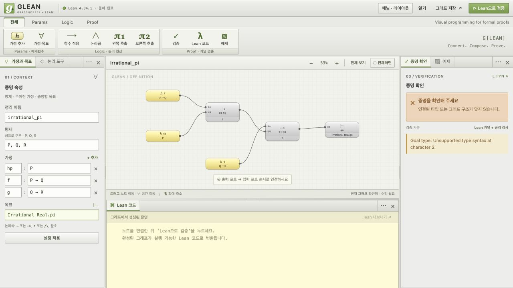
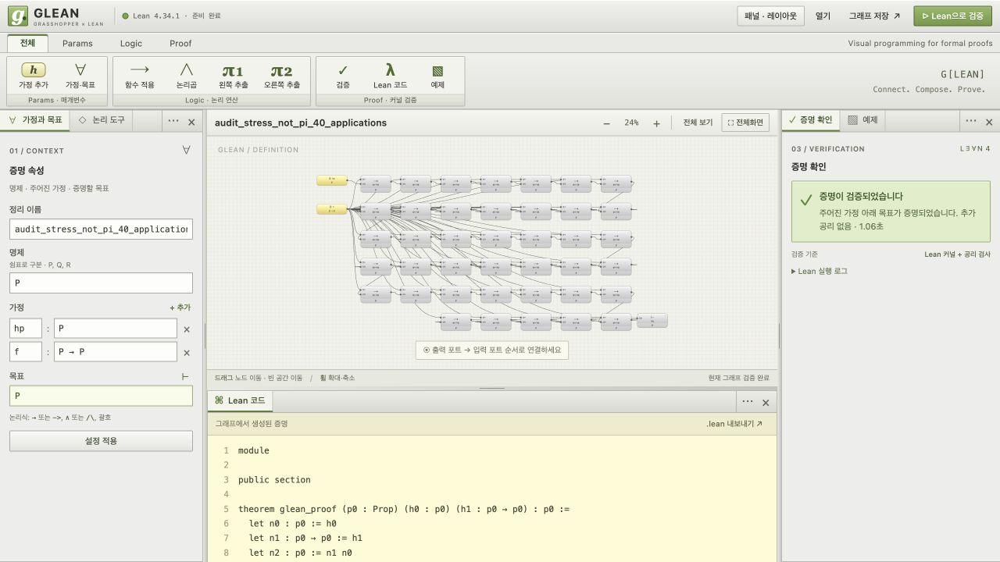
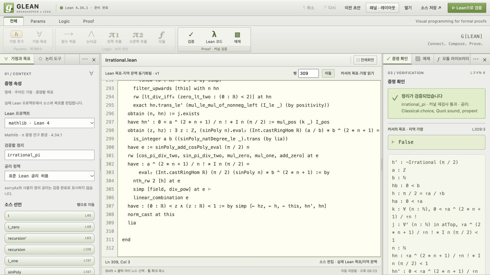

# GLEAN 실사용 점검: π의 무리성 증명

Copyright (c) 2026 GLEAN contributors. Released under Apache 2.0.

2026-10-07 · 에이전트 3개가 소스 실행, 증명 구조 분석, 브라우저 조작을 분담했다.

**최초 점검 당시 원본 수학 증명은 Lean에서 검증됐지만, GLEAN에서는 열거나 표현할 수 없었다.**
가장 큰 차이는 색상이나 노드 모양보다 수학적 표현 범위, 지역 가정과 목표의 관리,
Lean 프로젝트 연동에 있다. 지원되는 명제논리 그래프에서도 배치 변경에 따른 검증
결과 소실, 실행 취소 부재, 큰 그래프의 오류 탐색 문제가 재현됐다.

> 아래 관찰과 로그는 최초 점검 당시 결과를 보존한다. 이후 수정 상태는 문서 끝의
> **수정 후 확인**에 따로 기록한다.

## 대상과 시험 구분

- 대상: mathlib `Mathlib.Analysis.Real.Pi.Irrational`, `irrational_pi : Irrational π`.
- [원본 고정 커밋](https://github.com/leanprover-community/mathlib4/blob/d13f23b723b8a846827a245b89c10fc7d3f11612/Mathlib/Analysis/Real/Pi/Irrational.lean):
  `v4.34.1`, SHA `d13f23b723b8a846827a245b89c10fc7d3f11612`.
- Lean: GLEAN과 같은 `v4.34.1`. 원본 311줄, private 선언 15개(정의 3개·보조정리 12개),
  공개 정리 1개. 마지막 정리는 29줄이며 적분·귀납법·다항식·극한을 사용한다.
- [원본 소스](reference/Irrational.lean)와 [Apache 2.0 라이선스](reference/LICENSE)를 보존했다.
  해시와 다운로드 출처는 [manifest](reference/manifest.json)에 있다.
- 실제 π 증명 실행과 GLEAN의 지원 범위를 구별했다. 43노드 부하 그래프는 `P → P`를
  반복 적용하는 별도 합성 예제이며 **π 증명의 번역이나 검증 결과가 아니다.**
- 관찰을 보존하기 위해 이번 점검 중 제품 코드는 수정하지 않았다. 사람 참가자의
  사용성 실험이나 통계적 성능 벤치마크가 아닌, 재현 가능한 에이전트 워크스루다.

## 실제 Lean에서 해본 작업

격리된 `.glean-tools/mathlib-audit/mathlib4`에 공식 소스를 받았다. 전체 mathlib 빌드
대신 대상 모듈의 캐시를 요청했지만, 전이 의존성 때문에 캐시 파일 2,778개가 필요했다.
소스·의존성·산출물을 포함한 격리 환경은 약 2.8 GB다.

| 작업 | 실제 결과 | 관측 시간 |
| --- | --- | ---: |
| 수정하지 않은 311줄 원본을 Lean으로 검사 | 종료 코드 0, 성공 | 13.812초 |
| 정리 재사용: π의 무리성 및 `π ≠ 3`, 공리 출력 3회 | 종료 코드 0, 성공 | 35.083초 |
| `exact irrational_pi` 한 번만 쓰는 별도 래퍼 | 종료 코드 0, 성공 | 42.204초 |
| `¬ Irrational Real.pi`에 `irrational_pi`를 넣는 잘못된 증명 | 종료 코드 1, 명시적 타입 불일치 | 88.647초 |
| 원본 마지막 `lia`를 `exact hn`으로 바꾼 복사본 | 종료 코드 1, 부등식 증명을 `False`로 사용할 수 없음 | 22.054초 |

시간에는 해당 명령의 모듈 로딩과 공리 검사 등이 포함된다. 설치 시간은 제외했다.
단회 측정이며 다른 시험과 병행했으므로 일반적인 Lean 속도를 대표하지 않는다.
실패 두 건은 의도한 음성 대조군이며 실제 오류 로그를 확보했다.

명령·작업 디렉터리·종료 상태는 [실행 기록](evidence/reference-runs.json),
공리 목록은 [공리 출력](evidence/reference-wrappers.log), 마지막 단계 오류는
[변형본 오류 로그](evidence/reference-reject-final-step.log)에 있다.

`#print axioms irrational_pi`의 실제 결과는
`[propext, Classical.choice, Quot.sound]`다. `sorryAx`는 없었다.
이 목록은 표준 Lean 수학에서 사용되는 공리 의존성을 보여준다. 현재 GLEAN 서버는
공리 목록이 비어 있다는 정확한 문자열만 허용하므로, 이 수학을 수용하려면
**커널 검사 성공, 미완성 증명 여부, 공리 의존성 정책을 분리해야 한다.**
공리 검사를 단순히 끄는 해결책은 권하지 않는다.

## 이 증명에서 필요한 노드의 종류

| 실제 증명 단계 | 원본 위치 | 현재 모델에서 막히는 부분 |
| --- | --- | --- |
| 적분열 `I n θ` 정의, 두 번의 부분적분으로 점화식 유도 | 45, 63–120 | 값의 타입 `ℕ/ℝ`, 지역 함수, 미분·적분 정리, 여러 보조 목표 |
| `sinPoly`, `cosPoly` 재귀 정의와 차수 상계 | 147–190 | 패턴 분기, 귀납 가정, 정수계수 다항식 |
| 적분과 다항식 평가를 연결하는 항등식 | 197–207 | 매개변수에 의존하는 정리 적용, `calc` 등식 체인, 재작성 |
| 유리수에 다항식을 대입해 정수 증인 구성 | 215–230 | `∃ z : ℤ`, 증인과 그 성질, 타입 변환, 유한합 |
| 양수·상계·극한을 결합 | 239–279 | 부등식, 필터의 eventually, 양화사와 유리수 표현 |
| 유리수라는 가정에서 `0 < z < 1`인 정수를 만들어 모순 | 281–309 | 귀류법 범위, 지역 가정, 존재 증인 `a,b,n,z`, `False` 목표 |

소스에서 이름이 참조되는 관계와 커널이 정교화한 전체 의존성은 다르다.
예컨대 `cosPoly_natDegree_le`는 파일에 존재하지만 마지막 증명의 소스 이름 참조
경로에는 쓰이지 않는다. 파일 전체를 한 화면에 펼치는 것보다 현재 목표와 관련된
보조정리·가정·범위를 골라 보여줄 필요가 있다.

## 우선순위가 높은 표현·연동 장벽

P0은 실제 수학 작업을 시작하기 위한 선행 조건, P1은 지원되는 편집에서도 재현된
작업 방해, P2는 탐색·표시 개선을 뜻한다. 현 프로토타입의 알려진 범위 제한과
예상치 못한 편집 불편을 구분한다.

| ID | 우선순위 | 관찰과 영향 | 다음 구현의 완료 기준 |
| --- | --- | --- | --- |
| M01 | P0 | `.lean`을 열면 JSON 읽기 오류. 프로젝트·import·정리 목록을 가져올 경로가 없다. | 파일 종류를 구분하고 Lean 프로젝트/툴체인 상태와 선언 목록을 열 수 있다. 지원 밖 입력은 그 이유를 안내한다. |
| M02 | P0 | 실제 목표 `Irrational Real.pi`와 `∀ n : ℕ, n ≤ n`는 입력되지만 검증에서 문법 오류가 난다. 값·함수·등식·부등식·양화사를 표현하지 못한다. | Lean 정교화가 판정한 표현과 타입을 노드 입출력으로 사용한다. 소스와 연결되지 않은 `P` 치환을 원래 정리 증명으로 표시하지 않는다. |
| M03 | P0 | 한 목표의 평평한 DAG와 단일 출력은 `obtain ⟨a,b,hb,h⟩`, 귀납 분기, 지역 가정을 담지 못한다. | 범위 상자와 분기별 목표를 만들고, 범위 밖 지역 가정의 연결을 거부한다. 증인과 의존하는 증명을 함께 추적한다. |
| M04 | P0 | `rw`, `simp`, `ring`, `calc`, `by_contra`를 고정된 Apply/Pair 노드로 보존할 수 없다. | Lean 단계 또는 재사용 보조정리를 담는 컴포넌트가 이전·이후 목표와 해당 소스 범위를 보존한다. |
| M05 | P0 | 원본의 표준 공리 3개는 현 서버의 빈 공리 목록 조건과 맞지 않는다. | 커널 성공·`sorryAx`·허용 공리·사용자 정의 공리를 별도로 보고하고 정책에 따라 판정한다. |
| M06 | P1 | 원본 검사와 실제 오류 진단이 10초를 넘었다. 현재 서버 제한은 10초다. | 지속되는 Lean 작업 세션, 진행 상태, 취소와 충분한 작업별 시간 예산을 제공한다. 현재 API가 원본을 실행했다는 뜻은 아니며 연동 전 설계 위험이다. |

## 실제 UI 조작에서 재현한 불편

| ID | 우선순위 | 재현 작업과 실제 결과 | 개선 완료 기준 |
| --- | --- | --- | --- |
| U01 | P1 | 정상 예제 검증 → 노드 약 20px 이동. 검증이 취소되고 생성 코드와 내보내기가 사라진다. | 배치 변경과 논리 변경의 이력을 분리한다. x/y만 바꾸면 기존 증명 결과와 코드를 유지한다. |
| U02 | P1 | `f` 노드 삭제 → Cmd+Z 및 Ctrl+Z. 5노드·4와이어 상태에서 복원되지 않는다. | 삭제·연결 교체·입력 수정·노드 이동을 실행 취소/다시 실행할 수 있다. |
| U03 | P1 | 완성된 목표에 무관한 미연결 연습 노드를 둔다. 전체가 미완성으로 판정된다. | 목표 의존 그래프의 검증과 작업 중인 분리 노드 진단을 구분해서 보여준다. 엄격한 전체 검사도 별도 선택할 수 있다. |
| U04 | P1 | 43노드·81와이어 예제의 `apply20/fn` 오류로 이동. 24% 확대율은 그대로라 노드가 약 39×22px에 그친다. | 오류 포커스 시 읽을 수 있는 최소 배율로 확대하고 정확한 포트·노드 이름을 강조한다. |
| U05 | P2 | 실제 수학 입력을 검증하면 `Unsupported type syntax at character 2` 같은 영문 문자 위치만 나온다. | 필드와 문제 토큰을 강조하고 미지원 문법과 수학적 타입 오류를 구분한다. |
| U06 | P1 | 동일한 “함수 적용” 노드가 반복되고 생성 코드는 `n0`, `n1` 이름으로 바뀐다. | 원래 노드 ID·사용자 이름·Lean 소스 범위 사이에 양방향 이동을 제공한다. |
| U07 | P1 | 43노드 작업의 연결을 수리한 뒤 새로고침하면 기본 6노드 예제로 돌아간다. | 그래프 임시 저장과 복구 이력을 제공한다. 배치 저장과 증명 내용 저장 상태를 구분한다. |
| U08 | P2 | 캔버스를 더블클릭해도 컴포넌트 검색이 열리지 않는다. | 이름·타입·현재 목표로 정리와 컴포넌트를 검색해 추가한다. 현재 고정 도구 수에서는 진입 장벽보다 확장성 문제다. |

U03은 직접 컴파일러 실험이고 나머지는 브라우저 조작 관찰이다. 세부 행동 기록,
화면과 실제/추론의 구분은 [UI 점검 기록](ui-findings.json), 문법·구조 실험은
[컴파일러 프로브](compiler-probes.json)에 보존했다.

파일 가져오기 시험은 자동화 파일 선택기로 `.lean`을 전달했다. 일반 파일 선택기에서는
확장자 필터 때문에 처음부터 보이지 않을 수 있다. 원본 `.lean`을 정상 지원한다는
주장이 아니라, 현재 가져오기 경로의 제한을 확인한 시험이다.

프로브 20개는 거부 17개, 미완성 1개, 지원 문법 대조군 2개였다. 이는 증명 실패율이
아니라 의도적으로 지원 경계를 찌른 실험의 결과다. `imports`, `binders`, `sourceMap`을
JSON에 추가해도 조용히 무시되는 점도 확인했다. 미래 가져오기 기능은 이 필드들을
지원하는 것처럼 받아들이지 말고, 지원하는 스키마와 의미를 명시적으로 검사해야 한다.

### 실제 수학 목표 입력 결과



### 지원 문법으로 만든 별도 부하 그래프



전체화면은 같은 그래프의 확대율을 약 24%에서 65%로 높여 도움이 됐다. 패닝·휠 확대는
검증 상태를 유지했고, 누락된 연결을 직접 복구한 뒤 실제 Lean 검증도 통과했다.
따라서 큰 그래프 시험에서 모든 편집 기능이 실패한 것은 아니다.

## 다음 개발 순서

1. **복구와 결과 보존부터:** U01/U02/U07을 먼저 고친다. 현재 사용 가능한 그래프 편집의
   비용을 줄이면서 나중의 복잡한 증명 편집에도 그대로 필요한 기반이다.
2. **Lean 프로젝트와 실제 타입 연결:** M01/M02/M05/M06을 함께 다룬다. Lean 서버가
   정교화한 목표·지역 문맥·진단을 받아오고, 원본 파일을 기준으로 검사한다.
3. **범위를 가진 컴포넌트:** M03/M04를 구현한다. 모든 tactic을 즉시 자동 변환하는
   대신 보조정리 적용과 범위가 명확한 증명 블록부터 노드 편집을 지원한다.
4. **구체적 성공 기준:** 이 파일의 `is_integer` 또는 마지막 `irrational_pi`에서
   정리 적용 한 곳의 입력을 변경하고, Lean이 보고한 새 목표/오류를 해당 노드와
   원본 소스에서 왕복 확인한다. `sorry` 없이 원본 정리를 다시 검증하는 데 성공해야 한다.

Grasshopper의 데이터 흐름에 Lean의 **지역 문맥과 목표 변화**를 더하는 것이 핵심이다.
문자열을 붙인 노드만 늘리면 이 증명의 양화사·증인·귀류법 범위는 보존되지 않는다.

## 재현 자료

- [원본과 환경 정보](reference/manifest.json)
- [증명 연산별 분석](analysis.json)
- [실행 명령과 시간](evidence/reference-runs.json)
- [브라우저 재현 단계와 스크린샷](ui-findings.json)
- [전체 GLEAN 기준 검사 및 파일 해시](evidence/baseline-checks.json): JS 46개, Python 54개,
  GLEAN Lake 빌드, Lean smoke test 모두 통과했다. 이는 π 증명을 GLEAN이 지원한다는 뜻이 아니다.

저장소 루트에서 현재 표현 범위의 20개 프로브를 다시 실행한다:

```bash
python3 glean/research/2026-10-07-pi-audit/probe_compiler.py
```

Lean 원본의 재실행은 격리 mathlib 디렉터리에서, 고정 툴체인의 `lake env lean`으로
`reference/Irrational.lean`의 절대 경로를 검사한다. 정확한 명령과 작업 디렉터리는
실행 기록에 있다. GLEAN의 자체 Lake 디렉터리에는 mathlib 의존성을 추가하지 않았다.

## 수정 후 확인 — 2026-10-07

편집 복구·목표별 컴파일, Lean 프로젝트/LSP, 소스 검증·공리 정책을 병렬로 구현하고
브라우저에서 통합 점검했다. 이전 실험의 원본·프로브·로그는 변경하지 않았다.

| 항목 | 수정 상태 |
| --- | --- |
| M01 · `.lean` 열기 | 확장자에 따라 소스 편집기로 열고 프로젝트·검증할 정리·선언 목록을 표시한다. 실제 원본 311줄을 열어 검사했다. |
| M02/M03/M04 · 실제 수학과 문맥 | 소스 모드에서 실제 Lean 목표·지역 가정·타입·오류 위치를 연결했다. π의 309행에서 실제 정수 증인·부등식과 `⊢ False`를 확인했다. **의존 타입·범위·분기의 노드 편집과 자동 그래프 변환은 남아 있다.** |
| M05 · 표준 공리 정책 | 컴파일 후 별도의 Lean 커널 재검사와 대상 정리 공리 탐색을 실행한다. 표준 공리 3개는 기본 정책에서 허용하고 `sorryAx`·추가 공리는 별도 거부한다. 엄격 정책도 유지한다. |
| M06 · 오래 걸리는 검사 | 120초 제한의 비동기 검사, 단계 표시, 취소, 지속 Lean 세션을 제공한다. 오래된 결과가 새 문서에 적용되지 않도록 요청을 구분한다. |
| U01 · 배치와 검증 | 노드·그룹 이동과 접기·펼치기는 검증 상태와 생성 코드를 유지한다. 논리 변경만 무효화한다. |
| U02/U07 · 실행 취소와 복구 | 삭제·연결·속성·배치·소스의 50개 변경 이력, 자동 저장, 새로고침 복구, 직전 초안 복원을 추가했다. 새로고침은 검증 상태를 복원하지 않는다. |
| U03 · 미연결 작업 노드 | 전체 검사/목표 의존 노드 검사를 선택한다. 분리된 노드의 미완성·타입 오류는 별도 작업 진단으로 표시한다. 잘못된 구조·참조·순환은 계속 거부한다. |
| U04 · 오류 노드 확대 | 오류 위치로 이동할 때 최소 90% 배율을 적용한다. 접힌 그룹 내부와 함수 내부도 찾아간다. |
| U05 · 문법 오류 안내 | 한국어 원인과 지원 범위를 표시하고 목표/가정의 오류 문자로 이동한다. 실제 수식은 Lean 소스 모드로 안내한다. |
| U06 · 생성 코드 대응 | 컴파일러가 실제 생성 행의 노드 ID 대응을 반환한다. 소스 행 클릭으로 노드에 이동하고 노드 선택으로 해당 행을 강조한다. 함수 본문도 지원한다. |
| U08 · 더블클릭 검색 | 아직 구현하지 않았다. 현재 컴포넌트 리본과 함수 라이브러리에서 추가한다. mathlib 검색은 후속 작업이다. |

소스 검증 대조군에서는 π 원본이 통과했고, 마지막 `lia`를 `exact hn`으로 바꾼 파일은
309행 타입 오류로 거부됐다. `sorry`, 사용자 정의 공리, 위조한 성공 출력도 정상 검증으로
인정하지 않는다. 화면에서도 π 원본의 커널 재검사 통과와 표준 공리 목록을 확인했다.

최종 검사: JS **101/101**, Python **132건 중 130건 통과·선택형 통합 2건 제외**.
제외한 두 검사는 `GLEAN_SOURCE_INTEGRATION=1`로 별도 실행한 소스 검사 묶음
**12/12**에서 실제 Lean 대조군과 함께 통과했다. GLEAN Lake 빌드와 Lean smoke test도 통과했다.
브라우저에서는 파일 가져오기, 오류 행 이동, 소스 실행 취소·재검증, 그래프 삭제 복구,
새로고침 복구, 검사 범위 선택, 생성 코드 이동, 90% 오류 확대, 이동 후 결과 유지,
π 검사 취소·재시작과 실제 목표 조회를 확인했다.



실행 및 재현 명령은 [GLEAN 사용 안내](../../../GLEAN.md)의 **실제 Lean 소스와 π 증명**과
[API 계약](../../prototype/PROTOCOL.md)을 따른다. 이것은 소스 편집과 Lean 연결의 개선이며,
π 증명을 노드 그래프로 자동 변환했다는 결과가 아니다.
